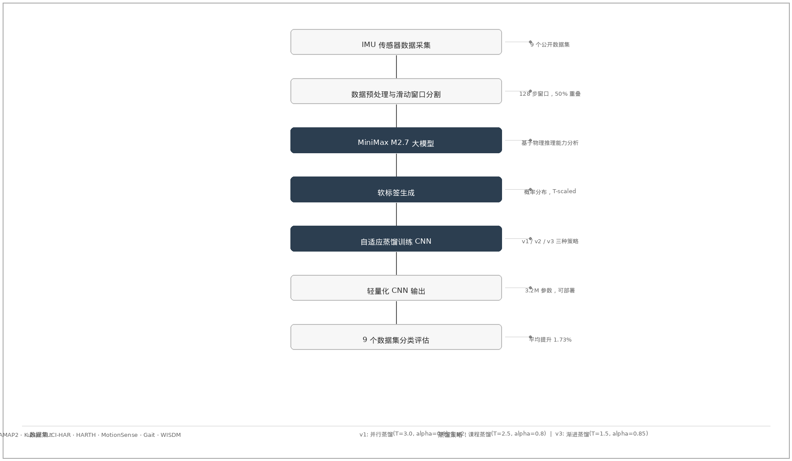

# 第1章 绪论

## 1.1 研究背景及意义

人体运动识别（Human Activity Recognition，HAR）是计算机视觉、模式识别与智能系统交叉领域的重要研究课题，其核心目标是通过传感器数据或视频序列，自动识别人类所从事的具体活动类别，如行走、跑步、坐卧、上下楼梯等。随着全球人口老龄化趋势加剧、慢性病发病率持续上升，以及人工智能技术的快速发展，人体运动识别技术在智能健康监测、运动康复评估、人机交互、智能可穿戴设备以及外骨骼机器人控制等领域展现出广阔的应用前景，成为推动智慧医疗和智能辅具发展的关键底层技术之一。

在智能健康监测领域，人体运动识别技术能够实时监测个体的日常活动模式和运动强度，为慢性病管理、术后康复评估以及老年人的跌倒风险预警提供数据支撑。传统的健康监测方式主要依赖定期体检和人工记录，存在数据采集不及时、主观性强、覆盖范围有限等不足。而基于可穿戴传感器的运动识别系统可以连续、客观地记录用户的活动情况，帮助医生更准确地评估患者的运动能力和康复进展。研究表明，持续的运动监测能够显著提高慢性病患者的治疗依从性，并降低并发症的发生风险。

在人机交互领域，人体运动识别技术为实现更自然、更智能的人机交互方式提供了可能。传统的按键、触控等交互方式存在一定的局限性，用户需要学习特定的操作指令，且难以适应复杂多变的实际应用场景。而通过识别人体姿态和运动意图，智能系统可以主动响应用户需求，提供更加个性化和便捷的服务。例如，在智能家居环境中，系统可以根据用户的运动状态自动调节灯光、温度和音乐等设备，创造更加舒适的生活体验。在虚拟现实和增强现实应用中，运动识别技术能够实现更逼真的沉浸式交互，提升用户的操作效率和体验满意度。

在智能辅具和康复机器人领域，准确识别用户的运动意图是实现人机协同控制的关键。以外骨骼机器人为例，穿戴式外骨骼需要实时感知用户的运动意图，并提供相应的助力支持。如果识别延迟过长或准确率不足，不仅会影响用户的使用体验，还可能导致安全隐患。因此，高精度、低延迟的运动识别算法对于提升智能辅具的响应速度和可靠性具有重要意义。此外，在运动康复评估方面，通过对患者康复训练过程中的运动数据进行自动分析，康复师可以更客观地评估康复效果，及时调整训练方案，提高康复训练的针对性和有效性。

从技术发展的角度来看，人体运动识别经历了从基于视觉的方法向基于传感器的方法演进的过程。早期研究主要依赖摄像头获取视频数据，并利用计算机视觉技术进行分析。然而，基于视觉的方法存在隐私保护难度大、对光照条件敏感、视野范围有限等固有缺陷，难以满足全天候、复杂场景下的应用需求。近年来，随着微机电系统（Micro-Electro-Mechanical Systems，MEMS）技术的快速发展，惯性测量单元（Inertial Measurement Unit，IMU）的体积不断缩小、精度持续提升、成本显著下降，使得基于可穿戴传感器的运动识别方法逐渐成为主流研究方向。IMU传感器包括加速度计、陀螺仪和磁力计等，能够直接穿戴在人体表面或集成到智能设备中，实时采集人体的加速度和角速度信号，对使用环境要求低，且能够有效保护用户隐私。

然而，基于传感器数据的人体运动识别研究仍面临诸多挑战。首先，人体运动具有高度的复杂性和多样性，不同个体在完成同一动作时可能存在显著的个体差异，同一个体在不同状态下（如疲劳、情绪变化）也会表现出不同的运动模式。其次，实际应用场景中的传感器数据往往存在噪声干扰、信号缺失和传感器漂移等问题，对算法的鲁棒性提出了更高要求。再次，传统机器学习方法在特征提取环节依赖领域专家的经验知识，特征设计的合理性和泛化能力难以保证，难以适应不断增长的数据规模和日益复杂的应用需求。

近年来，深度学习技术的快速发展为人体运动识别研究带来了新的机遇。卷积神经网络（Convolutional Neural Network，CNN）和循环神经网络（Recurrent Neural Network，RNN）等深度学习模型能够从原始传感器数据中自动学习层次化特征表示，在多个公开数据集上取得了显著优于传统方法的效果。其中，一维卷积神经网络（1D-CNN）因其计算效率高、参数规模适中且易于部署的特点，成为处理时序传感器数据的主流模型之一。然而，深度学习模型的训练通常需要大规模标注数据作为支撑，而在实际应用中，获取高质量标注数据的成本往往很高，且某些特定运动类别的样本收集困难，导致训练数据不足。此外，深度学习模型的推理过程通常需要较高的计算资源，在资源受限的可穿戴设备上难以直接部署，限制了其实际应用范围。

为了解决上述问题，知识蒸馏（Knowledge Distillation）技术受到了广泛关注。知识蒸馏是一种模型压缩与知识迁移技术，其核心思想是将大型、复杂教师模型（Teacher Model）中所蕴含的知识迁移到小型、紧凑的学生模型（Student Model）中，使得学生模型能够在保持较轻量级架构的同时，获得接近教师模型的性能表现。在人体运动识别任务中，大型预训练模型（如大语言模型和多模态大模型）可以作为教师模型，利用其强大的物理推理能力和泛化能力为传感器数据生成高质量的软标签（Soft Labels），这些软标签包含了比硬标签（Hard Labels，即独热编码的真实标签）更丰富的类别间相似性信息，有助于学生模型学习到更加细腻的决策边界。将知识蒸馏技术应用于运动识别，不仅可以缓解标注数据不足的问题，还能够将大模型的领域知识迁移到轻量级模型中，实现模型在精度和效率之间的良好平衡。

基于上述背景，本研究提出一种基于MiniMax大模型知识蒸馏的人体运动识别方法，利用MiniMax M2.7大模型的物理推理能力为IMU传感器窗口数据生成软标签，并通过设计多种自适应蒸馏策略提升CNN学生模型的运动分类准确率。这一研究不仅有助于推动人体运动识别技术在智能健康监测和康复评估等领域的实际应用，也为知识蒸馏技术在时序传感器数据分析中的应用提供了新的思路，具有重要的理论意义和应用价值。

## 1.2 国内外研究现状

人体运动识别技术经过多年发展，已形成较为完整的研究体系。本节将从传统机器学习方法、深度学习方法以及知识蒸馏在HAR中的应用三个方面对国内外研究现状进行综述。

### 1.2.1 传统机器学习方法

传统机器学习方法在人体运动识别研究中应用广泛，其基本流程包括数据预处理、特征提取和分类器设计三个主要环节。在特征提取方面，研究者提出了多种基于时域和频域分析的特征描述方法，包括均值、标准差、方差、均方根、峰值、偏度、峰度等统计特征，以及傅里叶变换功率谱特征、小波变换特征、主成分分析（PCA）特征等。 Bao等人系统地分析了加速度传感器数据的多种特征类型，并比较了决策树、朴素贝叶斯和线性判别分析等分类器的性能差异，结果表明基于多特征融合的方法能够有效提升识别准确率。

在分类器设计方面，支持向量机（Support Vector Machine，SVM）、随机森林（Random Forest）、K近邻（K-Nearest Neighbors，K-NN）和隐马尔可夫模型（Hidden Markov Model，HMM）等传统机器学习算法被广泛应用于运动识别任务。 Ravi等人比较了多种分类算法在加速度传感器数据上的识别效果，发现SVM在多类分类问题中表现较为稳健。 Incel等人综述了基于可穿戴传感器的运动识别研究进展，详细分析了数据采集设备、传感器配置、特征选择方法和分类算法等各个环节对识别性能的影响。

尽管传统机器学习方法在特定数据集上取得了较好的效果，但其性能高度依赖于人工设计的特征质量。不同数据集的传感器配置、采样频率和活动类型存在差异，针对某一数据集设计的特征方案往往难以直接迁移到其他数据集，泛化能力有限。此外，传统方法在处理高维特征时容易遇到维数灾难问题，需要依赖特征选择或降维技术来缓解，但这些预处理步骤又会引入额外的信息损失。

### 1.2.2 深度学习方法

深度学习技术的发展为人体运动识别带来了革命性变化。与传统方法相比，深度学习模型能够从原始数据中自动学习特征表示，避免了繁重的人工特征工程。卷积神经网络（CNN）因其在处理网格化数据（如图像和时间序列）方面的优势，成为运动识别领域的主流模型架构。

Ronao等率先将二维卷积神经网络应用于加速度传感器数据的运动识别，将传感器数据重构为伪图像形式，利用2D-CNN提取时空特征，在多个公开数据集上取得了显著优于传统方法的效果。Jiang等提出了DeepConvLSTM模型，将多个卷积层与长短期记忆网络（LSTM）相结合，同时提取局部空间特征和时间依赖关系。Heterogeneity等研究发现，一维卷积神经网络（1D-CNN）在处理原始传感器时序数据时具有良好的性能，且推理速度较快，适合实时应用场景。

近年来，注意力机制（Attention Mechanism）和Transformer架构也被引入运动识别研究。Transformer通过自注意力机制（Self-Attention）能够建模序列中任意位置之间的依赖关系，避免了RNN的梯度消失问题，且支持并行计算。Huang等提出了一个基于Transformer的多模态运动识别框架，通过跨模态注意力机制融合不同传感器的信息。Li等设计了一种轻量级的MobileNetV3-Transformer混合模型，在保持较高识别精度的同时显著降低了模型参数量。

然而，深度学习方法普遍面临训练数据需求量大、模型复杂度高、推理计算资源消耗大等问题。在实际应用中，高精度模型往往体积庞大，难以部署到资源受限的可穿戴设备上；而轻量级模型的精度又难以满足实际需求。这种精度与效率之间的矛盾成为制约深度学习技术落地应用的主要瓶颈。

### 1.2.3 知识蒸馏在HAR中的应用

知识蒸馏技术为解决上述精度-效率矛盾提供了有效途径。Hinton等首先系统地提出了知识蒸馏框架，通过让轻量级学生模型学习教师模型输出的软化概率分布（Soft Probabilities），实现知识从教师向学生的迁移。在软化概率中，类别之间的相似性信息被保留下来，为学生模型提供了比独热标签更丰富的学习信号。

Thoker等研究了知识蒸馏在视频动作识别中的应用，设计了跨模态蒸馏方案，让2D学生模型从3D教师模型中学习时空特征。Zhang等提出了一种多尺度特征蒸馏方法，通过在多个语义层次上进行知识迁移，提升学生模型对细节特征的感知能力。Chen等将知识蒸馏应用于基于惯性传感器的人体运动识别，利用预训练的深度模型作为教师，为传感器数据生成软标签，显著提升了轻量级模型的识别准确率。

在利用大模型生成软标签方面，已有研究探索了视觉-语言模型和物理推理模型在传感器数据分析中的应用。Wu等利用CLIP模型的视觉-语言对齐能力，为传感器数据生成描述性文本标签，辅助模型训练。Sarkar等研究了大型语言模型在时序数据分析中的推理能力，发现大模型能够基于传感器的物理特性进行逻辑推理，生成合理的运动类别预测。这些研究表明，大模型中蕴含的丰富知识可以有效迁移到下游感知任务中。

尽管知识蒸馏在运动识别领域已取得一定进展，但现有研究主要关注同构模型之间的知识迁移（即教师和学生模型属于同一类型），对异构模型之间的跨架构蒸馏研究尚不充分。此外，如何针对运动识别任务的特点设计有效的蒸馏策略，使软标签信息得到充分利用，仍有待深入探索。

## 1.3 研究目标与主要研究内容

### 1.3.1 研究目标

本研究针对人体运动识别任务中标注数据有限、模型泛化能力不足、轻量级模型精度受限等问题，探索利用MiniMax大模型生成高质量软标签并通过知识蒸馏提升CNN学生模型性能的方法。具体而言，本研究旨在设计一套面向IMU传感器数据的知识蒸馏框架，使学生CNN模型在有限的标注样本条件下仍能获得较高的运动分类准确率，同时保持较轻量的模型架构，为后续在可穿戴设备和嵌入式系统上的部署奠定基础。

### 1.3.2 主要研究内容

围绕上述研究目标，本文的主要研究内容涵盖以下几个方面：

（1）基于MiniMax大模型的软标签生成方法研究。深入分析IMU传感器窗口数据的物理特征，设计有效的提示模板（Prompt Template），引导MiniMax M2.7大模型对传感器窗口对应的运动类型进行推理判断，并生成包含类别概率分布的软标签。重点研究如何充分利用大模型的物理推理能力，使生成的软标签能够反映运动类别之间的语义相似性和物理关联性。

（2）面向运动识别的自适应蒸馏策略设计。研究三种自适应蒸馏策略：硬蒸馏与软蒸馏并行策略（v1）、先软后硬的课程蒸馏策略（v2）以及渐进式蒸馏策略（v3）。针对不同特点的数据集，分析各策略的适用性，找出最优的超参数组合（温度参数T和蒸馏损失权重α），实现蒸馏效果的最大化。

（3）基于CNN的学生模型架构设计。设计适合传感器时序数据处理的CNN模型架构作为学生模型，研究网络深度、卷积核大小、残差连接等关键设计要素对模型性能的影响，在保证模型轻量化的同时使其具备足够的学习能力来吸收教师模型传递的知识。

（4）多数据集验证与泛化能力分析。在多个公开人体运动识别数据集上进行系统性的实验评估，分析所提出方法在不同数据集、不同传感器配置和不同运动类别数量条件下的性能表现，验证方法的泛化能力和实用性。

## 1.4 论文结构安排

本文方法的总体流程如图2-1所示。首先通过IMU传感器采集人体运动原始数据，经滑动窗口分割与预处理后，利用MiniMax M2.7大模型基于物理推理能力为每个窗口生成软标签，再通过三种自适应蒸馏策略（并行蒸馏、课程蒸馏、渐进蒸馏）训练轻量级CNN学生模型，最后在9个公开数据集上评估分类性能。

本文共分为五章，各章内容安排如下：

第1章为绪论，介绍人体运动识别的研究背景与意义，综述国内外研究现状，明确本文的研究目标与主要研究内容，并给出论文的结构安排。

第2章为相关技术与理论基础，介绍人体运动识别的基本原理与方法，阐述知识蒸馏技术的核心思想和实现框架，分析卷积神经网络在时序数据处理中的应用，为后续研究奠定理论基础。

第3章为基于MiniMax大模型的软标签生成方法，详细描述软标签生成的整体流程、提示模板设计、传感器数据物理特征提取方法以及自适应蒸馏策略的设计原理。

第4章为实验设计与结果分析，介绍实验环境配置、使用的公开数据集、评价指标体系，并给出详细的实验结果和对比分析。

第5章为总结与展望，总结本文的研究工作和主要贡献，指出研究中的不足之处，并对未来研究方向进行展望。
