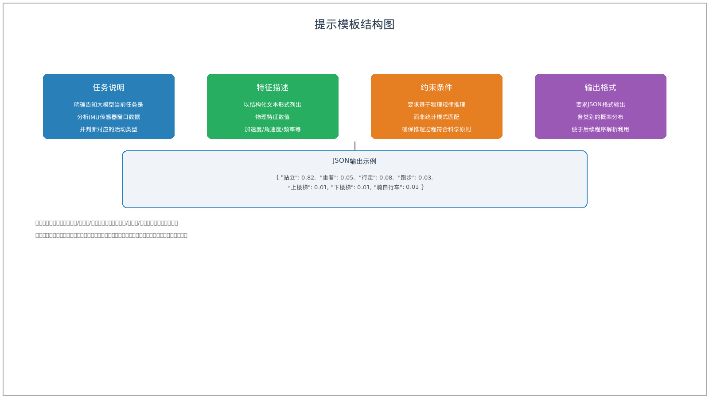
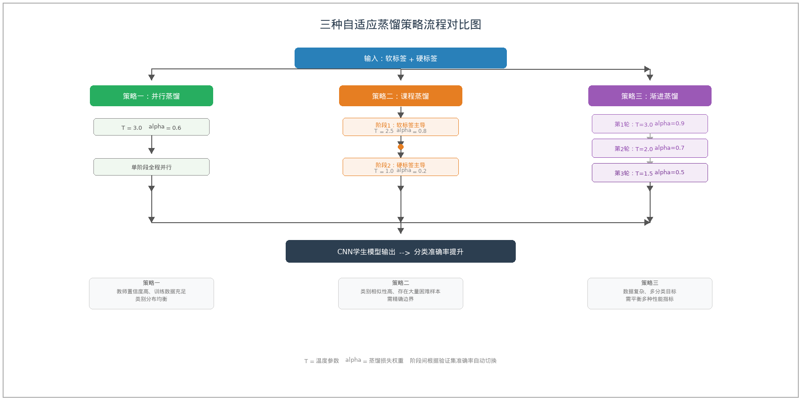

# 第3章 基于MiniMax大模型的软标签生成方法

本文方法的核心在于利用MiniMax M2.7大模型的物理推理能力为IMU传感器窗口数据生成软标签，并通过知识蒸馏提升CNN学生模型的性能。本章详细介绍软标签生成的整体框架、物理特征提取方法、提示模板设计以及自适应蒸馏策略的设计原理。

## 3.1 整体框架

### 3.1.1 方法概述

本文提出的基于MiniMax大模型知识蒸馏的人体运动识别方法，其整体框架包含四个主要环节：IMU传感器数据采集与预处理、传感器窗口物理特征提取、MiniMax M2.7大模型软标签生成、以及CNN学生模型蒸馏训练。

本文方法的总体流程如图3-1所示。


在数据环节，首先从9个公开人体运动识别数据集获取原始IMU传感器数据，包括三轴加速度计和三轴陀螺仪信号。原始数据经过滤波去噪、重力分离和标准化等预处理操作后，采用滑动窗口方法将连续时序数据切分为固定长度的分析窗口。

在特征提取环节，针对每个传感器窗口，计算一系列能够反映运动物理特性的统计特征和频域特征，包括加速度幅值、角速度幅值、信号峰值频率、信号能量等。这些物理特征具有明确的物理含义，能够被MiniMax M2.7大模型理解和推理。

在软标签生成环节，将提取的物理特征以结构化文本形式填入提示模板，作为MiniMax M2.7大模型的输入。大模型基于其强大的物理推理能力，对传感器窗口对应的运动类型进行分析判断，输出各类别的概率分布作为软标签。

在蒸馏训练环节，将大模型生成的软标签作为监督信号，与硬标签按一定权重组合，训练轻量级的1D-CNN学生模型。通过设计三种自适应蒸馏策略，使CNN学生模型能够充分吸收大模型的领域知识，提升运动分类准确率。

### 3.1.2 数据来源

本文使用9个公开人体运动识别数据集进行实验验证，各数据集的基本信息如表3-1所示。

**表 3-1 本文使用的9个公开数据集基本信息**

| 数据集 | 类别数 | 训练样本 | 测试样本 | 传感器通道 | 主要活动类别 |
|--------|--------|---------|---------|-----------|-------------|
| PAMAP2 | 5 | 2,200 | 884 | 6轴IMU | 下楼/坐着/站立/行走/慢跑 |
| KuHar | 18 | 20,000 | 19,129 | 8轴IMU | 站立/坐着/行走/跑步/上下楼梯等18类 |
| UCI-HAR | 6 | 5,881 | 2,947 | 9轴融合特征 | 行走/上楼梯/下楼梯/坐着/站立/躺着 |
| HARTH | 6 | 20,000 | 7,108 | 3轴手腕IMU | 左立/走路/上楼/下楼/右立/站立 |
| UCI-HAR-New | 12 | 5,000 | 3,162 | 9轴融合特征 | 6类基础活动+6类姿态转换活动 |
| MotionSense | 6 | 11,000 | 4,373 | 3轴手机IMU | 下楼/慢跑/坐着/站立/上楼/行走 |
| MotionSense-DM | 6 | 10,000 | 4,308 | 双模态IMU | 同MotionSense |
| Gait | 4 | 400 | 211 | 6轴脚踝IMU | 正常走/后退走/转圈走/站立 |
| WISDM | 6 | 10,864 | 3,395 | 3轴手机加速度计(128步时序) | 行走/慢跑/上楼/下楼/坐着/站立 |

这些数据集涵盖了不同传感器配置（单模态/双模态IMU、手机加速度计）、不同采样频率（20Hz至128Hz）和不同活动类别数量（4至18类），能够全面验证本文方法在各种条件下的有效性和泛化能力。

## 3.2 物理特征提取

### 3.2.1 特征设计原则

软标签的质量直接取决于输入特征的物理意义和表征能力。本文在设计物理特征时遵循以下原则：特征应具有明确的物理含义，能够反映人体运动的本质特性；特征应在大模型推理的可理解范围内，避免过度复杂的数据表示；特征应能够有效区分不同类别的运动，同时对同类运动的不同个体差异具有鲁棒性。

基于上述原则，本文针对每个传感器窗口提取三类物理特征：时域统计特征、频域特征和物理量纲特征。时域统计特征反映信号在时间维度上的分布特性；频域特征反映信号的频率组成特性；物理量纲特征基于力学和运动学原理，直接刻画运动的物理状态。

### 3.2.2 时域统计特征

给定一个传感器窗口，首先计算三轴加速度和三轴陀螺仪各自的总加速度幅值和总角速度幅值：

$$a_{mag}(t) = \sqrt{a_x(t)^2 + a_y(t)^2 + a_z(t)^2}$$

$$\omega_{mag}(t) = \sqrt{\omega_x(t)^2 + \omega_y(t)^2 + \omega_z(t)^2}$$

其中$a_x$、$a_y$、$a_z$为三轴加速度，$\omega_x$、$\omega_y$、$\omega_z$为三轴角速度。

时域统计特征包括以下几项，如表3-2所示。

**表 3-2 时域统计特征及其物理含义**

| 特征名称 | 计算公式 | 物理含义 |
|---------|---------|---------|
| 均值 | $\frac{1}{N}\sum_{t=1}^{N} x(t)$ | 信号的平均水平，与整体姿态相关 |
| 标准差 | $\sqrt{\frac{1}{N}\sum_{t=1}^{N}(x(t)-\mu)^2}$ | 信号的波动程度，与运动剧烈程度相关 |
| 均方根 | $\sqrt{\frac{1}{N}\sum_{t=1}^{N}x(t)^2}$ | 信号的有效能量，与运动持续强度相关 |
| 峰值 | $\max\|x(t)\|$ | 信号的最大瞬时值，与运动冲击强度相关 |
| 峰峰值 | $\max x(t)-\min x(t)$ | 信号的最大变化幅度 |
| 偏度 | $\frac{\frac{1}{N}\sum(x-\mu)^3}{\sigma^3}$ | 信号分布的不对称程度 |
| 峰度 | $\frac{\frac{1}{N}\sum(x-\mu)^4}{\sigma^4}-3$ | 信号分布的尖峭程度 |
| 信号能量 | $\sum_{t=1}^{N}x(t)^2$ | 信号幅值的平方和 |

此外，还计算三轴加速度各轴向的均值和标准差，反映运动在各方向上的分量特征。

### 3.2.3 频域特征

频域特征通过快速傅里叶变换（FFT）将时域信号转换到频域进行分析。频域特征能够反映运动的周期性特征，对于区分具有不同节律的活动尤为重要。

**表 3-3 频域特征及其物理含义**

| 特征名称 | 计算方法 | 物理含义 |
|---------|---------|---------|
| 主频率 | $\arg\max_f P(f)$ | 功率谱中能量最大的频率，反映运动主要节律 |
| 频谱熵 | $-\sum_f \frac{P(f)}{E}\log\frac{P(f)}{E}$ | 频率成分的分散程度，非周期运动熵值高 |
| 频谱能量 | $\sum_f P(f)^2$ | 信号在频域的总能量 |

对于周期性运动如行走和跑步，频谱能量集中在特定的主频率附近；对于非周期性运动如站立和坐着，频谱能量则较为分散地分布在低频区域。

### 3.2.4 物理量纲特征

物理量纲特征直接从力学角度刻画运动状态，具有最强的可解释性。

根据牛顿第二定律，加速度与作用力成正比，因此加速度的变化能够反映运动受力的变化。人体运动时，重力加速度始终存在，当人体相对于重力方向发生姿态变化时，加速度在各轴向的投影会发生变化。据此，可以通过分析三轴加速度的向量方向变化推断人体姿态和运动方向的变化。

角速度直接反映人体各轴向的旋转运动，角速度的大小与运动速度相关，角速度的方向与运动方向相关。

综合上述物理特征，能够为大模型提供全面且可理解的运动信息，使其能够准确推理出传感器窗口对应的运动类型。

## 3.3 提示模板设计

### 3.3.1 提示工程在HAR任务中的重要性

大语言模型的输出质量高度依赖于输入提示的设计。在知识蒸馏任务中，提示模板需要同时满足以下要求：清晰准确地描述任务要求，使大模型理解当前处理的是传感器数据分析任务；完整提供物理特征信息，使大模型能够基于物理规律进行推理；明确指定输出格式，使大模型输出能够被后续处理程序解析和利用。

### 3.3.2 提示模板结构

本文设计的提示模板包含四个组成部分：任务说明、特征描述、约束条件和输出格式要求。提示模板的整体结构如图3-2所示。

****

任务说明部分明确告知大模型当前任务是分析给定的IMU传感器窗口数据并判断对应的活动类型。特征描述部分以结构化文本形式列出提取的物理特征数值，使大模型能够快速获取关键信息。约束条件部分提出判断应基于物理规律而非统计模式匹配，确保推理过程符合科学原则。输出格式部分要求大模型以特定的JSON格式输出概率分布，便于后续程序解析。

完整的提示模板如下：

```
你是一位专注于人体运动分析的物理学家。给定一个IMU传感器窗口的物理特征，
请你分析并判断该窗口对应的活动类型。

物理特征如下：
- 加速度幅值均值：{a_mean:.2f} m/s²
- 加速度幅值标准差：{a_std:.2f} m/s²
- 加速度幅值峰值：{a_max:.2f} m/s²
- 角速度幅值均值：{w_mean:.2f} rad/s
- 角速度幅值标准差：{w_std:.2f} rad/s
- 角速度幅值峰值：{w_max:.2f} rad/s
- 主频率：{peak_freq:.2f} Hz
- 信号能量：{energy:.2f}

请基于以上物理特征进行物理推理，判断该传感器窗口对应的活动类型。
参考活动类别包括：站立、坐着、行走、跑步、上下楼梯、跳跃、骑自行车等。
请输出各类别的概率分布，格式为JSON。
```

该提示模板的优势在于：将物理特征与物理推理过程明确关联，引导大模型运用力学原理进行分析判断；特征描述使用标准物理量纲，便于大模型建立直觉性的物理图景；要求输出概率分布而非单一预测，使生成的软标签包含丰富的类别间相似性信息。

### 3.3.3 输出后处理

大模型输出的原始文本需要经过后处理才能得到可用于蒸馏训练的软标签。后处理步骤包括解析、验证和归一化三个环节。

解析环节从大模型输出的文本中提取JSON格式的概率分布。由于大模型的输出可能包含额外的解释性文本，需要通过正则表达式匹配和JSON解析提取有效的概率数据。

验证环节检查解析得到的概率分布是否满足数学约束：所有概率值应在0到1之间，概率之和应等于1（或在容差范围内接近1）。对于不满足约束的数据，进行修正或丢弃。

归一化环节确保概率分布严格归一化，使其符合软标签的数学定义。经过后处理得到的软标签可以直接用于蒸馏训练的损失函数计算。

## 3.4 自适应蒸馏策略设计

### 3.4.1 蒸馏损失函数

蒸馏训练的目标是同时最小化两项损失：学生模型预测与教师软标签之间的KL散度损失，以及学生模型预测与真实硬标签之间的交叉熵损失。综合损失函数定义为：

$$\mathcal{L} = \alpha \cdot \mathcal{L}_{\text{KD}} + (1-\alpha) \cdot \mathcal{L}_{\text{CE}}$$

其中$\mathcal{L}_{\text{KD}}$为KL散度损失，衡量学生模型与教师模型软标签分布之间的差异：

$$\mathcal{L}{\text{KD}} = \text{KL}(p_{\text{teacher}} \| p_{\text{student}}) = \sum_i p_i^{\text{teacher}} \log \frac{p_i^{\text{teacher}}}{p_i^{\text{student}}}$$

$\mathcal{L}{\text{CE}}$为标准交叉熵损失，衡量学生模型预测与真实标签之间的差异：

$$\mathcal{L}{\text{CE}} = -\sum_i y_i \log q_i$$

其中$y_i$为真实标签的独热编码，$q_i$为学生模型预测的类别概率。

温度参数$T$对软标签的概率分布具有调节作用：

$$p_i = \frac{\exp(z_i/T)}{\sum_j \exp(z_j/T)}$$

较高的温度参数使概率分布更加平滑，不同类别之间的概率差异被压缩；较低的温度参数使概率分布更加尖锐，预测类别与次优类别之间的差异被放大。温度参数的选择需要在保留类别间相似性信息与强调类别差异性之间取得平衡。

### 3.4.2 三种蒸馏策略对比

本文设计了三种自适应蒸馏策略，其核心差异体现在温度参数T和蒸馏损失权重α的设置方式以及训练流程的组织形式上。三种策略的对比如表3-4所示。

**表 3-4 三种自适应蒸馏策略对比**

| 策略 | 温度参数T | 蒸馏权重α | 训练流程 | 适用场景 |
|------|----------|-----------|---------|---------|
| 策略一 | 3.0（固定） | 0.6 | 单阶段并行 | 教师置信度高、数据充足 |
| 策略二 | 2.5→1.0（递减） | 0.8→0.2（递减） | 两阶段课程 | 类别相似性高、难易样本混杂 |
| 策略三 | 3.0→2.0→1.5（递减） | 0.9→0.7→0.5（递减） | 三轮渐进 | 数据复杂、多分类目标 |

三种蒸馏策略的流程对比如图3-3所示。

****

### 3.4.3 策略一：硬蒸馏与软蒸馏并行

策略一采用硬标签和软标签并行监督的方式，在整个训练过程中同时计算两项损失并反向传播。

该策略的特点是训练过程简单、稳定，不需要额外的学习率调度或阶段切换。硬标签监督确保学生模型在主要类别上达到较高的准确率，软标签监督则帮助学生模型学习类别间的细微差异，建立更合理的决策边界。

策略一的温度参数$T$和蒸馏损失权重$\alpha$分别设置为3.0和0.6，即软标签监督占总损失的60%，硬标签监督占40%。

### 3.4.4 策略二：先软后硬的课程蒸馏

策略二模拟人类由浅入深的学习特点，采用课程学习的思想，将训练过程分为两个阶段。

第一阶段为软标签主导阶段，学习率较高，硬标签权重较低。学生模型主要学习教师软标签提供的粗粒度类别区分能力，建立对各类别整体特征的基本认知。

第二阶段为硬标签主导阶段，学习率降低，硬标签权重提高。学生模型在已建立的粗粒度知识基础上，进一步学习硬标签提供的细粒度类别区分能力。

阶段切换的时机通过监控验证集准确率来确定。策略二的温度参数$T$在第一阶段设置为2.5，在第二阶段逐步降低至1.0。蒸馏损失权重$\alpha$在第一阶段设置为0.8，在第二阶段降低至0.2。

### 3.4.5 策略三：渐进式蒸馏

策略三采用三轮渐进式的蒸馏方式，每轮使用不同的蒸馏配置，逐步精细化学生模型的知识结构。

第一轮使用高温$T=3.0$和较大$\alpha=0.9$的软标签监督，引导学生模型学习粗粒度的运动模式分类。

第二轮在此checkpoint基础上，降低温度$T=2.0$和$\alpha=0.7$，引导学生模型在粗粒度分类的基础上进一步区分相似类别。

第三轮使用较低温度$T=1.5$和适中$\alpha=0.5$，在保证软标签监督的同时加强硬标签的作用。

每轮训练完成后，使用验证集评估模型性能，选择性能最优的checkpoint作为最终模型。

### 3.4.6 策略选择与超参数设置

在实际应用中，可以根据验证集上的实验结果选择最适合的超参数组合。温度参数$T$的选择应使软标签的熵值处于适中水平：过高的$T$使软标签趋近均匀分布，包含的信息量减少；过低的$T$使软标签趋近硬标签，失去软标签的优势。蒸馏损失权重$\alpha$的选择应平衡软标签学习和硬标签学习的重要性：过大的$\alpha$使模型过度依赖教师知识，可能在噪声较大的软标签上产生偏差；过小的$\alpha$则无法充分发挥蒸馏学习的优势。

## 3.5 本章小结

本章详细介绍了基于MiniMax大模型软标签生成方法的整体框架和关键技术环节。

在数据层面，本文使用9个公开人体运动识别数据集，数据集特征对比如表3-1所示，涵盖了不同的传感器配置、采样频率和活动类别，为验证方法的有效性和泛化能力提供了全面的实验基础。

在特征层面，本文设计了时域统计特征（表3-2）、频域特征（表3-3）和物理量纲特征三类物理特征，能够全面刻画传感器窗口对应的运动状态，同时具有明确的物理含义，便于MiniMax M2.7大模型理解和推理。

在提示工程层面，本文设计了包含任务说明、特征描述、约束条件和输出格式四部分的结构化提示模板，引导大模型运用物理规律进行分析判断，输出包含丰富类别间相似性信息的概率分布作为软标签。

在蒸馏策略层面，本文设计了三种自适应蒸馏策略，其超参数对比如表3-4所示。三种策略分别从不同角度优化蒸馏学习过程，为不同特点的数据集和分类任务提供了灵活的选择方案。
