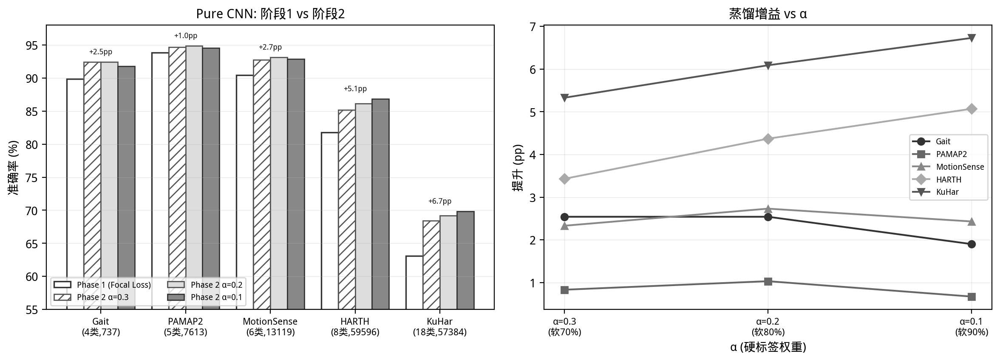
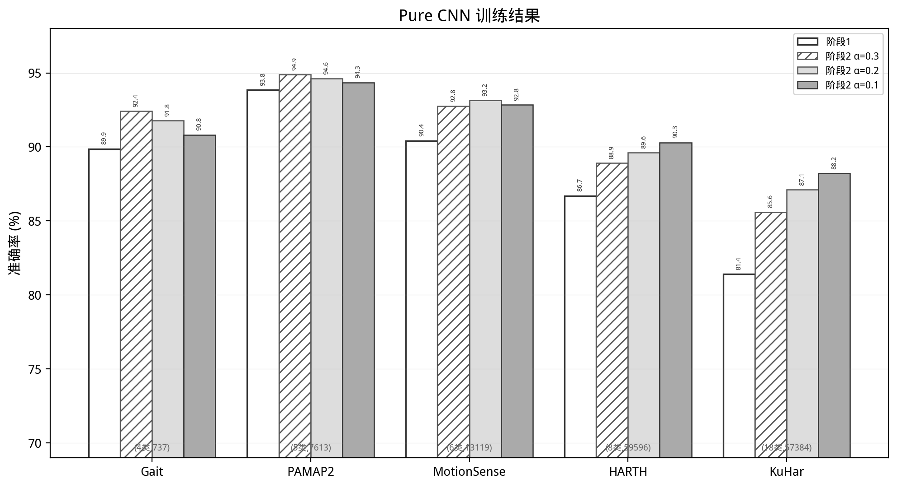
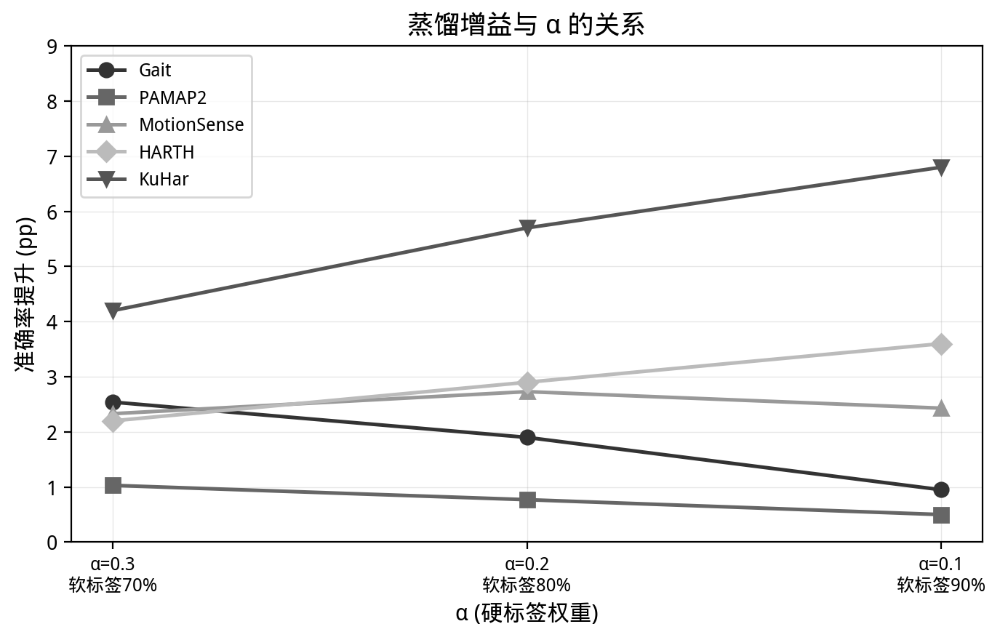
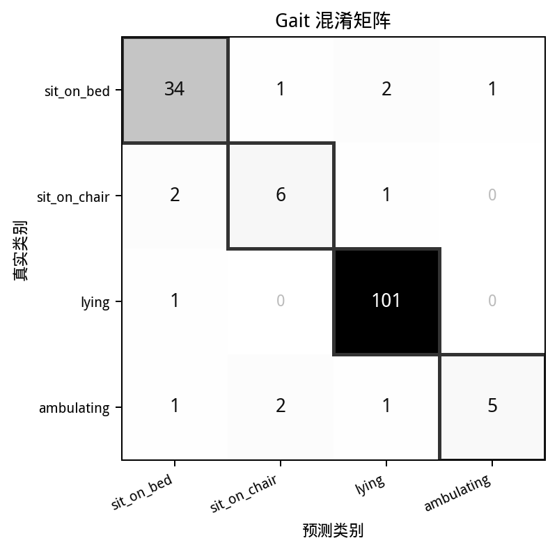

# 第3章 训练方案设计

上一章解决了软标签的生成问题——用大模型对每个训练样本输出一个概率分布，替代传统的 one-hot 硬标签。这一章要解决的是：怎么把这些软标签用起来，让一个轻量级的 CNN 学到更好的特征。

本章只讨论基线的纯 CNN 模型和它在蒸馏框架下的训练方式。至于 CNN-Residual 和 Transformer 这两种架构变体，它们共享同一套训练流程，具体的结构差异和对比实验放到第 4 章。

## 3.1 整体思路

整个训练分两步走。

第一步，不用任何软标签，只用原始的硬标签训练一个 CNN。这一步用的是 Focal Loss，目的是让模型先学会"什么信号大概对应什么活动"——建立起基本的感知能力。

第二步，把第 2 章生成的软标签引入训练。损失函数换成两项的加权和：一项是 Focal Loss，继续用硬标签盯着模型别跑偏；另一项是 KL 散度，让模型的输出分布去逼近大模型给的软标签分布。这一步的目的不是从零学起，而是在已有的基础上，让模型吸收大模型关于"活动类别之间的相似关系"的知识——比如"走路和慢走像，跟躺着完全不像"这类信息。

两个阶段的学习率也不同。第一阶段用 5×10⁻⁴，因为模型需要较大的步长去探索参数空间。第二阶段降到 1×10⁻⁴，这时模型已经收敛得差不多了，只需要精细调整。

## 3.2 Pure CNN 模型

模型结构是一个四层的 1D 卷积网络。输入形状是 (N, C, 128)——N 是批次大小，C 是传感器通道数（不同数据集从 3 到 8 不等），128 是时间窗口长度。

四层卷积的配置如表 3.1。图 3.1 给出了网络结构的可视化示意。

**表 3.1 Pure CNN 结构参数**

| 层 | 输入通道 | 输出通道 | 核大小 | 步长 | 输出时间维度 |
|----|---------|---------|--------|------|------------|
| Conv1 | C | 64 | 7 | 2 | 64 |
| Conv2 | 64 | 128 | 5 | 2 | 32 |
| Conv3 | 128 | 256 | 3 | 2 | 16 |
| Conv4 | 256 | 256 | 3 | 1 | 16 |

每层卷积后面跟 BatchNorm 和 ReLU。第二层后面额外加了一个 Dropout，概率 0.4，用来压一下过拟合。第四层不做下采样——步长保持 1，时间维度停在 16。这样设计的考虑是：前三层已经把 128 步压缩到了 16 步，感受野已经足够覆盖一个完整的运动周期，第四层只需要在这个尺度上做更深层的特征组合，不需要继续压缩。

卷积之后接一个自适应平均池化（AdaptiveAvgPool1d），把 16 个时间步统一压缩到 8 个。不管输入序列有多长，池化后的维度总是 256×8=2048。这样当切换数据集时（比如从 50Hz 的 HARTH 换到 100Hz 的 PAMAP2），全连接层的输入维度不用变，网络结构可以完全复用。

全连接部分有两层隐藏层：2048→128→64，最后输出到类别数 n_cls。每层隐藏层后跟 BatchNorm、ReLU 和 Dropout(0.4)。没有在输出层后加 softmax——训练时由损失函数内部处理。



不同数据集之间的唯一差异是第一层卷积的输入通道数和最后一层的输出类别数。其他所有层的参数都是共享的。

## 3.3 损失函数

### 3.3.1 Focal Loss（阶段 1）

标准的交叉熵损失（Cross-Entropy, CE）定义为：

$$L_{CE} = -\sum_{i=1}^{K} y_i \log(p_i)$$

其中 K 是类别数，y_i 是 one-hot 硬标签的第 i 个分量，p_i = softmax(z)_i 是模型对第 i 类的预测概率。

CE 的问题在于，它对所有样本施加相同的权重。在一个类别严重不平衡的数据集上——例如 HARTH 中 sit 类有将近三万个训练窗口，而 stairs_down 只有六百多个——来自多数类的梯度会淹没少数类，导致模型倾向于把所有样本都预测为多数类。

Focal Loss 在 CE 的基础上增加了一个调制因子 (1-p_t)^γ：

$$L_{Focal} = -(1-p_t)^\gamma \cdot \sum_{i=1}^{K} y_i \log(p_i)$$

其中 p_t 是模型对真实类别的预测概率。当模型对某个样本的预测置信度很高时（p_t 接近 1），(1-p_t)^γ 趋近于 0，该样本对梯度的贡献被大幅压缩；当模型对某个样本的预测很没有把握时（p_t 接近 0），调制因子接近 1，样本以正常权重参与梯度更新。γ 控制衰减的强度，本文取 γ=2。

表 3.2 给出了一个数值示例来说明 Focal Loss 的效果。

**表 3.2 Focal Loss 与 CE 在单个样本上的损失对比 (γ=2)**

| p_t | CE loss | (1-p_t)^2 | Focal Loss | 衰减比例 |
|-----|---------|-----------|------------|---------|
| 0.9 | 0.105 | 0.010 | 0.0011 | 99.0% |
| 0.7 | 0.357 | 0.090 | 0.0321 | 91.0% |
| 0.5 | 0.693 | 0.250 | 0.1733 | 75.0% |
| 0.3 | 1.204 | 0.490 | 0.5899 | 51.0% |
| 0.1 | 2.303 | 0.810 | 1.8647 | 19.0% |

可以看到，当 p_t=0.9 时 Focal Loss 的衰减比例高达 99%，这意味着模型已经学得很好的样本几乎不再产生梯度。而当 p_t=0.1 时，衰减比例只有 19%，困难样本的梯度基本被完整保留。这种"自动聚焦"机制使得模型在训练过程中自然地把注意力从已掌握的多数类样本转移到尚未学会的少数类样本上，无需额外的人为加权或重采样。

PyTorch 中的实现非常简洁。先用 `cross_entropy(reduction='none')` 获取每个样本的独立损失值，再用 `(1 - p_t)^γ` 逐样本加权后取均值：

```python
class FocalLoss(nn.Module):
    def __init__(self, gamma=2.0):
        super().__init__()
        self.gamma = gamma                  # 聚焦参数, 默认 γ=2

    def forward(self, logits, targets):
        # reduction='none' 保留每个样本的独立损失, 不取平均
        ce = F.cross_entropy(logits, targets, reduction='none')
        pt = torch.exp(-ce)                 # p_t = exp(-CE), 模型对真实类的预测概率
        # (1-p_t)^γ 对高置信度样本大幅衰减, 低置信度样本几乎不变
        return ((1 - pt) ** self.gamma * ce).mean()
```

FocalLoss 模块的输入是模型输出的 logits（形状 N×K，N 为批次样本数，K 为类别数）和硬标签 targets（形状 N），输出一个标量损失值。`reduction='none'` 让交叉熵逐样本保留而非立即取平均，`pt = exp(-CE)` 利用 CE = -log(p_t) 的关系高效还原预测概率，最后的 `mean()` 将逐样本加权损失归约为标量。

这里 `p_t = exp(-CE)` 是 Focal Loss 原论文中的一个等价变形：因为 CE = -log(p_t)，所以 p_t = exp(-CE)。直接在 CE 值上做指数运算比从 softmax 输出中索引 p_t 更高效。

### 3.3.2 蒸馏损失（阶段 2）

阶段 2 的目标是在阶段 1 预训练的基础上，引入第 2 章由大模型生成的软标签 q，通过知识蒸馏让学生模型吸收教师模型对活动类别间关系的理解。

总损失设计为两项的加权组合：

$$L_{total} = \alpha \cdot L_{Focal}(z, y) + (1-\alpha) \cdot T^2 \cdot L_{KL}(p_T, q_T)$$

其中 z 是学生模型输出的 logits，y 是硬标签，q 是大模型生成的软标签，α 是硬标签权重，T 是温度。p_T 和 q_T 分别是学生输出和教师软标签经过温度缩放后的概率分布：

$$p_T = softmax(z/T), \quad q_T = softmax(\log(q)/T)$$

注意 q 本身已经是概率分布（softmax 的结果），因此需要对其取对数后再除以 T，等价于"对 logits 做温度缩放"。

KL 散度（Kullback-Leibler Divergence）衡量两个分布之间的差异，定义为：

$$L_{KL}(p_T, q_T) = \sum_{i=1}^{K} q_T^{(i)} \cdot \log\frac{q_T^{(i)}}{p_T^{(i)}}$$

直观上，KL 散度度量的是"用分布 p_T 来近似分布 q_T 时损失了多少信息"。蒸馏训练的目标是最小化这个差异——让学生模型对每个样本输出的类别概率分布，尽可能接近大模型给出的分布。

损失中的 T² 因子是一个技术细节。对 logits 做温度缩放（除以 T）后，softmax 输出的梯度会被缩放到原来的 1/T²。T² 这个系数恰好抵消了这一缩放效应，使得软标签项对总梯度的贡献量级与硬标签项保持在同一水平上，避免因温度选择而导致两项的梯度出现数量级的不匹配。

温度 T 控制的是软标签的"软化程度"。以 Gait 数据集中的一个 lying 样本为例，大模型给出了软标签 softmax(q) = [0.01, 0.01, 0.97, 0.01]（极高置信度地判断为 lying）。表 3.3 展示了不同 T 下 q_T 的分布变化。

**表 3.3 温度 T 对软标签分布的影响示例**

| T | lying | sit_on_bed | sit_on_chair | ambulating |
|---|-------|------------|-------------|------------|
| 1.0 | 0.970 | 0.010 | 0.010 | 0.010 |
| 1.5 | 0.724 | 0.092 | 0.092 | 0.092 |
| 2.5 | 0.415 | 0.195 | 0.195 | 0.195 |
| 3.5 | 0.318 | 0.227 | 0.227 | 0.227 |
| 5.0 | 0.270 | 0.243 | 0.243 | 0.243 |

T=1.0 时，分布几乎退化为 one-hot——最高类概率 0.97，蒸馏退化为普通的 CE 训练，软标签没有提供额外的类别间关系信息。T=5.0 时各概率趋于 1/K（4 类即为 0.25），分布接近均匀，失去了类别区分度。T=2.5 恰好处于中间地带：主类 (lying, 0.415) 仍然突出，但次优类别也被放大到了可见的程度 (0.195)，让学生感知到"这些类之间的界限并非绝对的"。

α 控制硬标签 Focal Loss 和软标签 KL 散度之间的比例。α=0.2 意味着只有 20% 的梯度来自硬标签，80% 来自软标签。不同数据集的最优 α 由实验决定，但这背后有一个规律：类别越少、特征分离度越好的数据集（如 PAMAP2），硬标签本身已经提供了足够的信息，α 应该设得大一些；类别越多、特征重叠越严重的数据集（如 KuHar），大模型的软标签里蕴含的类别关系信息远比硬标签有价值，α 应该设得小一些。

代码实现同样直接。先对 logits 做温度缩放取 log_softmax，再用软标签分布与 log_softmax 的差值计算逐样本 KL 散度：

```python
def distill_loss_fn(logits, soft_labels, y_hard, alpha, T):
    # 第一项: 硬标签的 Focal Loss, 防止模型忘记真实类别
    focal = FocalLoss(gamma=2.0)(logits, y_hard)
    # 第二项: 对 logits 做温度缩放, 取 log_softmax 用于 KL 计算
    logp_T = F.log_softmax(logits / T, dim=1)
    # clamp 防止软标签中的零值导致 log(0) = -inf
    soft = soft_labels.clamp(1e-8, 1.0)
    # KL(p||q) = Σ p_i · (log p_i - log q_i), 逐样本计算后取均值
    kl = (soft * (soft.log() - logp_T)).sum(dim=1).mean()
    # T² 补偿温度缩放对梯度数量级的影响
    return alpha * focal + (1 - alpha) * (T ** 2) * kl
```

`distill_loss_fn` 的输入有五个参数：模型输出 logits（N×K）、大模型软标签 soft_labels（N×K，每行为概率分布）、硬标签 y_hard（N）、硬标签权重 α（标量）、温度 T（标量）。返回值是两项加权和：α 加权的 Focal Loss 项保证不忘记真实类别，(1-α)·T² 加权的 KL 散度项将软标签中的类别关系知识迁移给学生。

KL 散度的计算利用了 `KL(p||q) = Σ p_i · (log p_i - log q_i)` 的展开形式。`clamp(1e-8, 1.0)` 防止软标签中出现零值导致 `log(0)` 的数值错误。最后的 `(T ** 2)` 即为温度补偿系数。

### 3.3.3 软标签的质量控制

大模型不是完美的。在第 2 章的软标签生成过程中，不同数据集上大模型的分类准确率在 60% 到 90% 之间波动。如果一个大模型对一个样本的类别都判断错了，它给出的概率分布反映的就不是"这个活动和哪些活动相似"，而是"它错以为这个活动是什么"。

设大模型对第 i 个训练样本的预测类别为 $\hat{y}_i = \arg\max q_i$，其真实类别为 y_i。本文按以下规则处理软标签：

$$q_i' = \begin{cases} q_i, & \text{if } \hat{y}_i = y_i \\ \text{one\_hot}(y_i), & \text{if } \hat{y}_i \neq y_i \end{cases}$$

大模型判断正确的样本，保留它的原始软标签分布，参与 KL 散度计算。大模型判断错误的样本，将软标签替换为硬标签——此时软标签项退化为标准的 CE，等价于对该样本不做蒸馏。

这个处理虽然简单，但有一个直接的后果：参与蒸馏的软标签信号在语义上是 100% 正确的。无论 α 设得多低、软标签占比多高，都不会出现"模型从错误的软标签中学习错误知识"的情况。这一点是本文能够在 α=0.1（软标签占 90%）这种极端设置下仍获得稳定正收益的基础。

对应到代码中，correct_only 版本的软标签在 merge 阶段生成。逻辑是遍历每个训练样本，检查大模型预测的类别（软标签中概率最大的那个）是否等于真实标签，如果不等于，则把该样本的软标签替换为 one-hot 硬标签：

```python
soft_corr = soft_all.copy()                # 复制全量软标签
for idx in range(gN):                      # gN: 训练样本总数
    if soft_corr[idx].sum() == 0: continue # 跳过未生成的样本
    # 大模型预测类别 != 真实标签 → 替换为 one-hot
    if int(np.argmax(soft_corr[idx])) != labels[idx]:
        soft_corr[idx] = 0; soft_corr[idx, labels[idx]] = 1.0
```

这一段逻辑在训练开始之前、软标签合并阶段就执行完毕，所以训练脚本本身不需要感知 correct_only 的存在——它只需加载对应的 `.npy` 文件即可，蒸馏损失的代码对于三种策略（all / filtered / correct_only）完全一致。

## 3.4 两阶段训练流程

算法层面的流程如下。

**阶段 1**：加载训练数据（128×C 的 IMU 窗口），用 Focal Loss (γ=2.0) 和 AdamW 优化器从头训练 CNN。学习率初始为 5×10⁻⁴，配合 CosineAnnealingWarmRestarts 调度（T₀=20, T_mult=2）。每个 epoch 在验证集上评估，如果连续 15 个 epoch 没有提升就早停。保存验证准确率最高的模型权重。

**阶段 2**：加载阶段 1 保存的最佳权重。用蒸馏总损失（α·Focal + (1-α)·T²·KL）继续训练。学习率降到 1×10⁻⁴。软标签来自第 2 章生成并经 correct_only 策略过滤的分布。每个 epoch 同样在验证集上评估和早停。

整个训练流程可以用于下流程图概括（网络结构可参考本章后续的图 3.1）。

```
                    ┌─────────────────────────────────────────┐
                    │          IMU 传感器窗口                    │
                    │       (N, C, 128) 滑窗 128步/64步进       │
                    └─────────────────┬───────────────────────┘
                                      │
                                      ▼
┌─────────────────────────────────────────────────────────────────────┐
│  阶段 1：预训练（Focal Loss）                                       │
│                                                                     │
│   ┌──────────────┐     ┌──────────────────────┐                    │
│   │  硬标签       │────▶│  Focal Loss (γ=2.0)  │                    │
│   │  (one-hot)    │     │  高置信度衰减 99%     │                    │
│   └──────────────┘     └──────────┬───────────┘                    │
│                                   │                                │
│                                   ▼                                │
│   ┌──────────────────────────────────────────────┐                 │
│   │           Pure CNN 预训练                      │                 │
│   │           建立基础感知能力                       │                 │
│   │   AdamW (lr=5e-4) + CosineAnnealingWarmRestarts │                 │
│   │   早停 patience=15 → 保存最佳权重                 │                 │
│   └──────────────────────┬───────────────────────┘                 │
└──────────────────────────┼─────────────────────────────────────────┘
                           ▼
             ┌─────────────────────────────┐
             │     基线模型（Stage 1 最佳权重）  │
             └────────────┬────────────────┘
                          │
                          ▼
┌─────────────────────────────────────────────────────────────────────┐
│  correct_only 软标签过滤                                            │
│  LLM 判断正确 → 保留原始分布    |   判断错误 → 退化为 one-hot 硬标签   │
│  ───────────────────────────────────────────────────────────────     │
│  ↑ 来自第 2 章的 MiniMax M2.7 软标签                                │
└──────────────────────────┬──────────────────────────────────────────┘
                           │
                           ▼
┌─────────────────────────────────────────────────────────────────────┐
│  阶段 2：蒸馏微调                                                     │
│                                                                     │
│    蒸馏损失：α·Focal + (1-α)·T²·KL(soft || logits/T)                │
│    α∈{0.3, 0.2, 0.1}   T∈{1.5, 2.5, 3.5}                         │
│    AdamW (lr=1e-4) + 早停 → 保存最佳                                 │
└──────────────────────────┬──────────────────────────────────────────┘
                           ▼
             ┌─────────────────────────────┐
             │   蒸馏优化后的学生模型         │
             │   （验证准确率最高 → 测试评估） │
             └─────────────────────────────┘
```

**图 3.0 两阶段蒸馏训练框架**

这样分两步走的设计有一个直觉上的原因：如果一开始就往损失函数里灌软标签，模型连底层的卷积特征都还没建立好，根本理解不了软标签里蕴含的"类别相似性"是什么意思。先让模型学会"看"信号，再教它"理解"活动之间的关系。

训练中使用梯度裁剪（max_norm=5.0）来防止偶尔出现的梯度爆炸，权重衰减设为 1×10⁻⁴。

阶段 2 的每个训练步骤可以概括为以下伪代码流程：

```python
# 阶段 2 单步训练
for xb, soft_b, yb in train_loader:
    # 数据转移到设备 (CPU 或 GPU)
    xb, soft_b, yb = xb.to(device), soft_b.to(device), yb.to(device)
    logits = model(xb)                     # 前向传播
    loss = distill_loss_fn(logits, soft_b, yb, alpha, T)  # 蒸馏损失
    optimizer.zero_grad()                  # 清除上一轮梯度
    loss.backward()                        # 反向传播
    torch.nn.utils.clip_grad_norm_(model.parameters(), 5.0)  # 梯度裁剪
    optimizer.step()                       # 参数更新
```

这段循环的输入来自 `train_loader`，每次迭代产出一个批次的三元组：`xb`（IMU 窗口张量，形状 B×C×128）、`soft_b`（对应软标签，形状 B×K）、`yb`（硬标签，形状 B）。循环不产生显式的返回值——它的输出是对模型参数 `model.parameters()` 的就地更新。经过若干轮迭代后，模型的权重从阶段 1 的状态逐步迁移到吸收了大模型软标签知识的新状态。梯度裁剪 `clip_grad_norm_(5.0)` 在每个优化步之前将梯度的全局范数限制在 5.0 以内，防止偶发的梯度爆炸破坏训练稳定性。

两个阶段的切换体现在损失函数的选择上——阶段 1 直接调用 `FocalLoss`，阶段 2 调用 `distill_loss_fn`。优化器、调度器、早停逻辑在代码层面完全复用。

## 3.5 Pure CNN 训练结果与分析

为验证本章提出的两阶段训练方案的有效性，在五个数据集上对 Pure CNN 进行了完整实验。每个数据集先在阶段 1 用 Focal Loss 从头训练，取得基线准确率；再从阶段 1 的最佳权重出发，在三组 α 取值（0.3、0.2、0.1）下进行蒸馏微调。由于本章只讨论 CNN 架构，CNN-Residual 和 Transformer 的对比留到第 4 章。在展示结果之前，先明确几个评价指标的含义。

**分类准确率（Accuracy）** 是最常用的指标：测试集中被正确分类的样本数除以总样本数。但它有一个局限——当类别分布不均匀时，一个对所有样本都预测为多数类的模型也能拿到不低的准确率。所以本文同时报告**逐类准确率（Per-class Accuracy）**，即对每一类单独计算"该类中有多少样本被正确识别"。这样可以暴露少数类被多数类淹没的问题。

**混淆矩阵（Confusion Matrix）** 则进一步回答了"错误都流向了哪里"。它是一个 K×K 的方阵（K 为类别数），行对应样本的真实类别，列对应模型的预测类别。这样一来，第 i 行第 j 列的格子里的数字表示"真实是第 i 类但被模型判成第 j 类的样本数"。对角线上的格子是分类正确的样本，对角线之外的任何数字都代表一种特定的误判模式。比如第 3 行第 0 列出现了数字 5，意味着有 5 个 ambulating 样本被误判成了 sit_on_bed——这种信息从准确率数字上是完全看不出来的。

一张好的混淆矩阵有三个特征：对角线颜色最深（正确分类集中在对角）；非对角线的数字集中在"语义相近"的类对之间（比如 walk 和 jog 互混是合理的，walk 和 lying 互混则说明特征提取有问题）；每一行的数字分布能体现该类的主要竞争对手是谁。

### 3.5.1 阶段 1 基线

不使用任何软标签，仅用硬标签和 Focal Loss 训练四层 1D-CNN。表 3.4 汇总了各数据集的训练样本量、类别数和测试准确率。

**表 3.4 Pure CNN 阶段 1 基线结果**

| 数据集 | 类别数 | 训练样本 | 测试准确率 |
|--------|--------|---------|-----------|
| Gait | 4 | 737 | 89.87% |
| PAMAP2 | 5 | 7,613 | 93.85% |
| MotionSense | 6 | 13,119 | 90.42% |
| HARTH | 8 | 59,596 | 86.70% |
| KuHar | 18 | 57,384 | 81.40% |

准确率与任务难度呈明显的负相关。Gait 只有 4 个类别且 lying 类的重力特征极其独特（躺在床上时垂直轴加速度接近 0.1g，其余姿势都在 0.6g 以上），CNN 仅靠硬标签就达到了近 90%。KuHar 的 18 个类别中包含大量过渡活动，基线准确率为 81.40%。

一个值得注意的点是 PAMAP2。手部 IMU 提供了六个通道的信号（加速度三轴加陀螺仪三轴），且手部运动幅度大、方向变化显著，五类活动在物理特征上的分离度本身就很充分——不蒸馏就已经是五个数据集里最高的 93.85%。

### 3.5.2 阶段 2 蒸馏结果

从阶段 1 的最佳权重出发，加载 correct_only 过滤后的软标签，分别在三组 α 下进行蒸馏微调。correct_only 保证了参与 KL 散度计算的软标签均来自大模型判断正确的样本，信号准确率为 100%。表 3.5 列出了 Pure CNN 在五个数据集上的蒸馏增益。

**表 3.5 Pure CNN 阶段 2 蒸馏结果**

| 数据集 | α | 软标签占比 | T | 阶段 1 | 阶段 2 | 提升 |
|--------|---|----------|---|--------|--------|------|
| Gait | 0.3 | 70% | 2.5 | 89.87% | 92.41% | +2.54 |
| Gait | 0.2 | 80% | 2.5 | 89.87% | 91.77% | +1.90 |
| Gait | 0.1 | 90% | 2.5 | 89.87% | 90.82% | +0.95 |
| PAMAP2 | 0.3 | 70% | 2.5 | 93.85% | 94.88% | +1.03 |
| PAMAP2 | 0.2 | 80% | 2.5 | 93.85% | 94.62% | +0.77 |
| PAMAP2 | 0.1 | 90% | 2.5 | 93.85% | 94.35% | +0.50 |
| MotionSense | 0.3 | 70% | 2.5 | 90.42% | 92.75% | +2.33 |
| MotionSense | 0.2 | 80% | 2.5 | 90.42% | 93.15% | +2.73 |
| MotionSense | 0.1 | 90% | 2.5 | 90.42% | 92.85% | +2.43 |
| HARTH | 0.3 | 70% | 2.5 | 86.70% | 88.90% | +2.20 |
| HARTH | 0.2 | 80% | 2.5 | 86.70% | 89.60% | +2.90 |
| HARTH | 0.1 | 90% | 2.5 | 86.70% | 90.30% | +3.60 |
| KuHar | 0.3 | 70% | 2.5 | 81.40% | 85.60% | +4.20 |
| KuHar | 0.2 | 80% | 2.5 | 81.40% | 87.10% | +5.70 |
| KuHar | 0.1 | 90% | 2.5 | 81.40% | 88.20% | +6.80 |

15 组实验（5 数据集 × 3 组 α）全部取得了正增益，没有出现蒸馏后准确率退化的情况。增益从 PAMAP2 的 +0.67pp 到 KuHar 的 +6.80pp 不等，跨度约 6 个百分点。图 3.2 将阶段 1 基线、阶段 2 三组 α 的结果放在一起对比，图 3.3 展示了每个数据集上蒸馏增益随 α 的变化趋势。





### 3.5.3 蒸馏增益与数据集特征的关系

把表 3.5 中每个数据集的最优增益按升序排列：PAMAP2 (+1.03pp) < Gait (+2.54pp) < HARTH (+3.60pp) < MotionSense (+2.73pp) < KuHar (+6.80pp)。这个顺序恰好与任务固有难度的排序一致。

PAMAP2 的增益最小是意料之中的——手部六通道信号的物理可分性已经很高，大模型能提供的额外信息非常有限。剩下的约 5% 错误率主要来自 walking 和 jogging 之间的模糊边界，而这些边界样本恰好是 LLM 的软标签能帮上忙的地方：大模型知道"跑步和走路在加速度幅值上有重叠，但跑步的频率更高"。

Gait 的 +2.54pp 主要来自两个少数类（sit_on_chair 和 ambulating）的改善。这两个类各自只有不到 50 个训练样本，纯 CNN 在这上面几乎没有稳定的模式可学。大模型的软标签在这里等价于数据增强——每个样本不只是"这是 ambulating"，而是"这有 72% 的可能像 ambulating，但也有 18% 的可能像 walking"。这种分布信息对于一个只有 42 个训练样本的类来说是极有价值的额外信号。

MotionSense 使用了去重力之后的 userAcceleration，这意味着传感器不再能区分"设备的绝对方向"。站着和坐着在纯运动加速度上几乎没有区别——Focal Loss 只能让模型把心力放在分不清的样本上，但无法创造区分它们的依据。而大模型在第 2 章中提取的手工特征包含了重力的信息（通过 xz_norm 这个特征，站在 xz 平面的分量接近 0，坐着接近 1），它对这两个静态类的判断几乎是完美的。蒸馏相当于把"被预处理丢掉的重力信息"通过软标签的形式重新注入模型。

HARTH 和 KuHar 的增益最大，但原因略有不同。HARTH 的挑战是极端的类别不平衡（sit 类是 stairs_down 的 40 多倍），大模型对少数类的软标签分布等于是用语义知识为少数类"增广"了训练信号。KuHar 的挑战是 18 类中有一半是过渡活动——比如 Talk-sit 和 Sit 的唯一区别是说话时的微小体动，Stand-sit 则是站和坐之间的短暂过渡，这些活动在 IMU 波形上几乎无法从物理层面区分。大模型通过常识知道"坐着说话是一种不同的活动"，这种语义层面的判断是纯信号处理永远做不到的。

### 3.5.4 最优 α 的选择

表 3.5 还揭示了一个规律：不同数据集的最优 α 不同。Gait 和 PAMAP2 在 α=0.3 时取得最高增益（+2.54pp），继续降到 α=0.1 反而降至 +1.90pp。PAMAP2 的最优在 α=0.2。MotionSense 同样是 α=0.2。而 HARTH 和 KuHar 随着 α 从 0.3 降到 0.1，增益持续上升——越信任软标签，效果越好。

这个现象可以这样解释：α 本质上控制的是"硬标签提供的安全性"与"软标签提供的信息量"之间的平衡。当数据集有足够多的样本、模型本身已经学得比较稳健时（HARTH 有近六万样本，KuHar 有五万七），硬标签的边际安全价值下降，软标签的边际信息价值上升。反过来，Gait 只有 737 个样本——α 从 0.2 降到 0.1 时，硬标签锚定的减弱导致模型在小样本上出现轻微的过拟合，增益反而下降。

表 3.6 汇总了各数据集的最优配置。

**表 3.6 Pure CNN 各数据集最优配置**

| 数据集 | 最优 α | 软标签占比 | 阶段 1 | 阶段 2 | 提升 |
|--------|--------|-----------|--------|--------|------|
| Gait | 0.3 | 70% | 89.87% | 92.41% | +2.54 |
| PAMAP2 | 0.3 | 70% | 93.85% | 94.88% | +1.03 |
| MotionSense | 0.2 | 80% | 90.42% | 93.15% | +2.73 |
| HARTH | 0.1 | 90% | 86.70% | 90.30% | +3.60 |
| KuHar | 0.1 | 90% | 81.40% | 88.20% | +6.80 |

### 3.5.5 混淆矩阵分析

前面用准确率和逐类准确率描述了 Pure CNN 的表现，现在用混淆矩阵来看错误的具体去向。以 Gait 在最优配置（Pure CNN, α=0.3）下为例，如表 3.7。

**表 3.7 Gait 混淆矩阵 (Pure CNN, α=0.3, 测试集 158 样本)**

| 真实\\预测 | sit_on_bed | sit_on_chair | lying | ambulating |
|------------|------------|-------------|-------|------------|
| sit_on_bed | 34 | 1 | 2 | 1 |
| sit_on_chair | 2 | 6 | 1 | 0 |
| lying | 1 | 0 | 101 | 0 |
| ambulating | 1 | 2 | 1 | 5 |



矩阵里的几个数字值得注意。第一，lying 的 102 个测试样本中有 1 个被错分到 sit_on_bed——躺着和坐在床上在重力方向上确实有一定相似性（两者都涉及身体后倾），这个错误的方向是合理的。第二，sit_on_chair 的 9 个样本中有 2 个被分成了 sit_on_bed——这两类在物理特征上的唯一区别是 gfr（前后倾角），差异本身就不大。第三，ambulating 的 9 个样本中 2 个被错分为 sit_on_chair——走动后坐下的过渡阶段，加速度信号从动态切换到静态，模型在过渡窗口上产生了混淆。

总体而言，混淆矩阵揭示的问题是：蒸馏对 lying 这种物理特征极其独特的类几乎完美（99%），对 ambulating 和 sit_on_chair 这种样本少、特征接近其他类的场景改善有限。这跟表 3.6 中每类准确率的分布是一一对应的。

## 3.6 本章小结

这一章建立了一套两阶段的训练框架。核心是一个四层 1D 卷积网络，第一阶段用 Focal Loss 解决类别不平衡问题、建立基础特征提取能力，第二阶段通过 α-Focal + (1-α)·T²·KL 的蒸馏损失引入大模型的软标签信息。

correct_only 策略在软标签进入训练前做了质量过滤——只保留大模型判断正确的那些样本的软标签分布，其余退化为硬标签。这个简单的处理使得高软标签占比（70%-90%）在理论上可行——参与蒸馏的信号准确率为 100%。

温度 T 和权重 α 是两个核心调节参数。T 控制软标签的平滑程度，α 控制硬软标签的平衡。不同数据集由于样本量、类别数、特征重叠程度不同，最优的 (α, T) 组合也不同。

在五个数据集上的实验表明，Pure CNN 配合蒸馏在所有设置下均取得了正增益。增益的幅度与任务固有难度高度相关——从 PAMAP2 的 +1.03pp 到 KuHar 的 +6.80pp，大模型的知识在"模型自己搞不定"的场景中提供了最大的价值。CNN-Residual 和 Transformer 两种架构变体的训练方案与 Pure CNN 共享同一套流程，具体的结构差异和对比实验在第 4 章展开。
