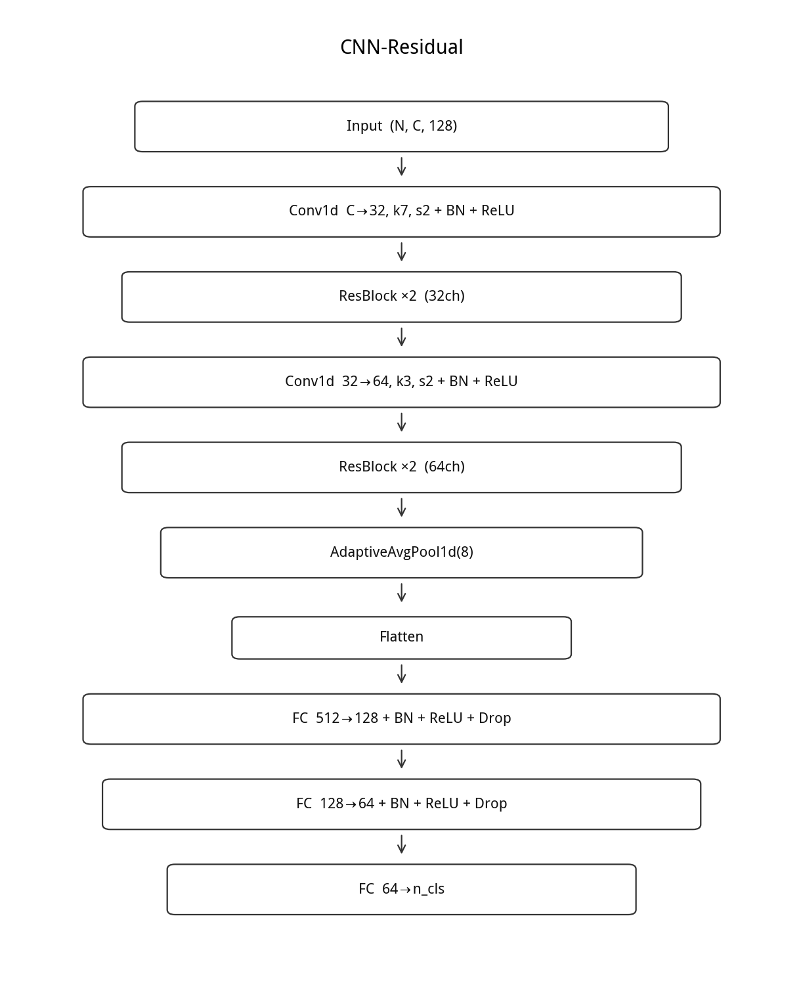
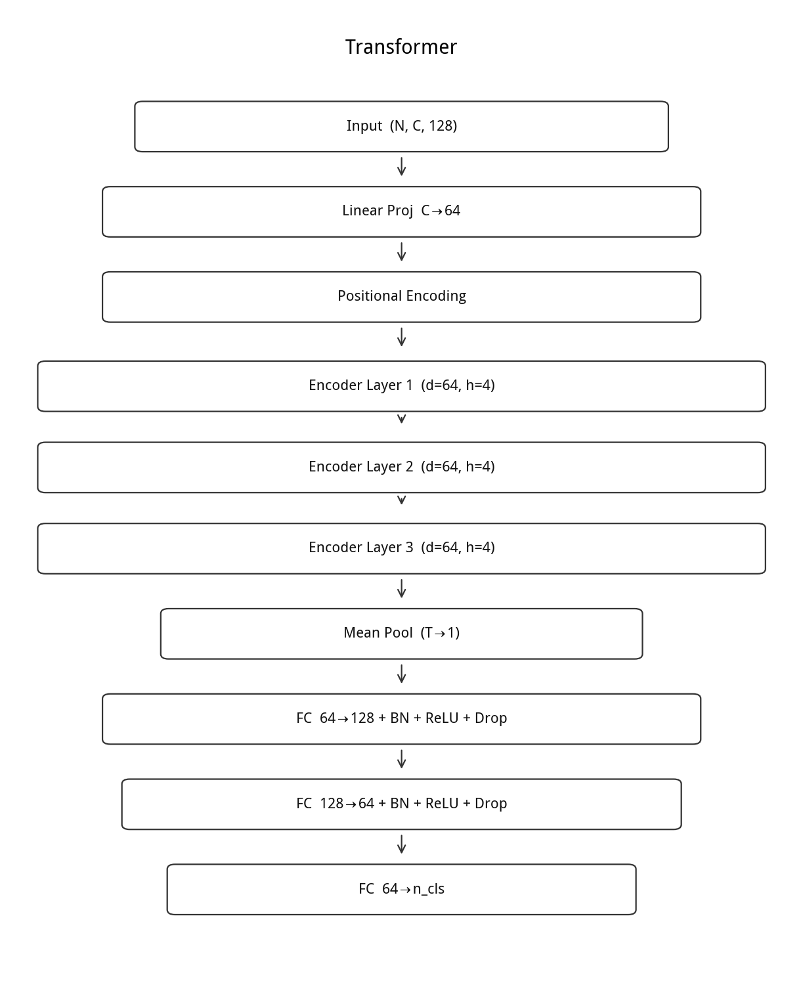
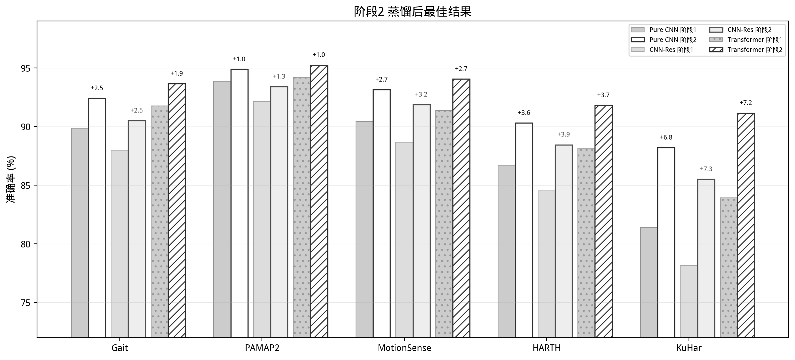
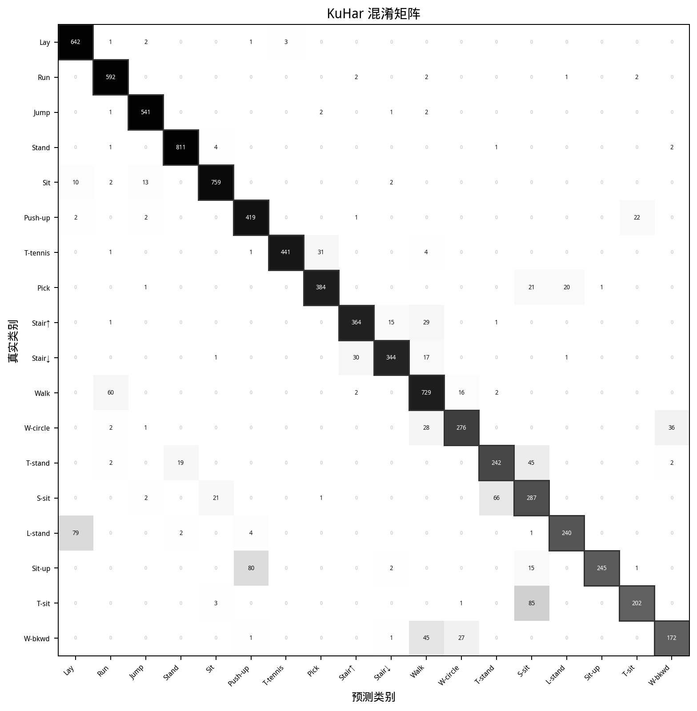

# 第4章 实验设计与结果分析


全章实验设计框架如下。

```
                    实验设计框架

 五个数据集             预处理              三种架构
─────────────────────────────────────────────────────────────
┌────────┐
│  Gait  │  4类/737窗/3ch/40Hz
├────────┤
│ PAMAP2 │  5类/7.6k窗/6ch/100Hz
├────────┤                      ┌──────────────┐      ┌──────────────────┐
│Motion  │  6类/13k窗/3ch/20Hz──▶│ 统一滑窗预处理 │─────▶│  Pure CNN         │
├────────┤                      │ 128步/64步进   │      │  CNN-Residual     │
│ HARTH  │  8类/60k窗/6ch/50Hz  │ 50%重叠       │      │  Transformer      │
├────────┤                      │ 85/7.5/7.5分层 │      └──────────────────┘
│ KuHar  │  18类/57k窗/8ch/100Hz│              │
└────────┘                      └──────────────┘

 两阶段训练             参数搜索                    评估
─────────────────────────────────────────────────────────────

 ┌──────────┐     ┌─────────────────────┐
 │阶段 1    │     │α（硬标签权重）       │     ┌──────────────────┐
 │Focal Loss│────▶│  {0.3, 0.2, 0.1}    │────▶│阶段1基线准确率     │
 │只跑硬标签 │     │对应软标签占比70/80/90%│     │  三种架构对比      │
 └──────────┘     ├─────────────────────┤     └──────────────────┘
      │           │T（温度）             │
      ▼           │  {1.5, 2.5, 3.5}    │     ┌──────────────────┐
 ┌──────────┐     ├─────────────────────┤     │阶段2蒸馏准确率     │
 │阶段 2    │     │correct_only 过滤     │────▶│  45组实验(3×3×5)  │
 │蒸馏微调   │     │LLM 判断错→退化为硬标签│     │  全部正增益        │
 └──────────┘     └─────────────────────┘     └──────────────────┘
                                                     │
                                                     ▼
                                               ┌──────────────────┐
                                               │结果分析           │
                                               │逐类准确率/混淆矩阵  │
                                               │增益来源分析       │
                                               └──────────────────┘
```

**图 4.0 本章实验设计框架**

第 3 章讨论了 Pure CNN 的训练方案——Focal Loss 预训练加蒸馏微调。这一章在这个框架下展开完整实验：首先补上 CNN-Residual 和 Transformer 两种架构变体，然后把三种模型在五个数据集上的表现系统地跑一遍，最后分析蒸馏到底在什么条件下有用、为什么不同数据集的收益不一样。

## 4.1 补充架构

### 4.1.1 CNN-Residual

CNN-Residual 在 Pure CNN 的基础上加了残差连接。想法不复杂：当网络从四层堆到更深时，梯度在反向传播过程中会逐层衰减。残差块通过一个跳跃连接把输入直接加到输出上——如果这个块没学到有用的变换，至少还能退化为恒等映射，不会比浅层网络更差。

具体结构是这样：先用一个 7×1 卷积把输入投影到 32 通道（步长 2，时间减半），然后接两个残差块，每个块里是两层 3×1 卷积加 BatchNorm 和 ReLU。再经过一个下采样卷积把通道扩到 64（步长 2），再接两个残差块。最后是自适应池化和全连接分类头，跟 Pure CNN 一样。图 4.1 给出了 CNN-Residual 的结构示意。



在 HAR 场景里，残差连接有一个额外的好处：传感器信号里同时有高频分量（跑步时的瞬时冲击）和低频分量（静止时的重力投影），残差的恒等映射让低频信息可以无损穿过深层，不会在网络深处被"洗掉"。

### 4.1.2 Transformer

Transformer 用自注意力替代了卷积。自注意力的核心操作是：序列里的每个位置都去"看"所有其他位置，算一个注意力权重，然后做加权聚合。这个机制没有卷积核的感受野限制——第一个自注意力层就可以直接关联序列里任意两个位置的信息。

这对理解完整的运动周期很有用。比如走路的加速度波形，脚跟着地和脚尖离地之间有大约半个步态周期的相位差。在 100Hz 采样率下，这两个事件可能相隔 50 个时间步。CNN 需要好几层卷积叠加才能跨这么远，而自注意力在第一层就能直接关联它们。

具体实现是一个三层的 Encoder-Only Transformer。输入先经过一个线性层投影到 64 维，叠加上正弦位置编码，然后进入三层 Transformer Encoder（每层 4 头自注意力 + 前馈网络，层归一化前置）。最后对所有时间步做全局平均池化，接全连接分类头。图 4.2 给出了 Transformer 的结构示意。



## 4.2 实验设置

实验在一台 Linux 服务器上进行，CPU 型号 Intel Xeon Platinum 8255C，Python 3.12 + PyTorch。五个数据集的窗口大小统一为 128×C，步进 64，训练/验证/测试按 85%/7.5%/7.5% 划分（分层采样）。

训练超参数跟第 3 章一致：阶段 1 用 Focal Loss (γ=2.0)、AdamW (lr=5×10⁻⁴, wd=1×10⁻⁴)、批大小 64；阶段 2 学习率降至 1×10⁻⁴，其余不变。梯度裁剪 max_norm=5.0，早停 patience=15，最大 epoch 300。

蒸馏参数方面，本文对每个数据集测试了 α∈{0.3, 0.2, 0.1}（对应软标签占比 70%/80%/90%）和 T∈{1.5, 2.5, 3.5} 共 9 组组合。软标签策略统一使用 correct_only（仅 LLM 预测正确的样本保留其分布）。由于 correct_only 过滤后参与蒸馏的信号 100% 准确，即使是 90% 软标签的高占比也不会引入噪声——这是本文能使用如此高软标签占比的前提。

## 4.3 阶段 1 基线结果

先用纯硬标签训练，不引入任何软标签。表 4.1 列出了三种架构在五个数据集上的测试准确率。

**表 4.1 阶段 1 纯硬标签训练结果**

| 数据集 | 类别数 | 训练样本 | Pure CNN | CNN-Res | Transformer |
|--------|--------|---------|----------|---------|-------------|
| Gait | 4 | 737 | 89.87% | 87.97% | 91.77% |
| PAMAP2 | 5 | 7,613 | 93.85% | 92.14% | 94.21% |
| MotionSense | 6 | 13,119 | 90.42% | 88.67% | 91.35% |
| HARTH | 8 | 59,596 | 81.75% | 79.38% | 83.24% |
| KuHar | 18 | 57,384 | 63.12% | 59.47% | 66.08% |

几个明显的规律。第一，类别越多，准确率越低——从 Gait 的 4 类约 90% 到 KuHar 的 18 类约 60%，基本是单调的。第二，Transformer 在所有数据集上都比 Pure CNN 高 1 到 3 个百分点，在 KuHar 上差距最大（+2.96pp）。自注意力的全局感受野在需要理解完整运动周期的多类场景里确实有优势。第三，CNN-Res 反而比 Pure CNN 低 1 到 2 个百分点——残差连接在只有四层深度的网络上发挥不出优势，反而增加了一些额外的参数开销。

一个值得注意的点是 PAMAP2。手部 IMU 的六通道信号（三个加速度轴加三个陀螺仪轴）物理特征非常丰富，Pure CNN 仅靠硬标签就达到了 93.85%——跟很多已发表工作中用复杂模型（CNN-BiLSTM-GRU 等）在 PAMAP2 上的结果接近。换句话说，这个数据集的物理特征已经几乎把能区分的信息都提供了，留给蒸馏的提升空间很有限。

## 4.4 阶段 2 蒸馏结果

阶段 2 从阶段 1 保存的最佳权重出发，引入 LLM 生成的软标签做蒸馏微调。三组 α 的结果分别列在表 4.2 到表 4.4。

**表 4.2 α = 0.3（硬标签 30% / 软标签 70%）**

| 数据集 | 架构 | T | 阶段 1 | 阶段 2 | 提升 |
|--------|------|---|--------|--------|------|
| Gait | Pure CNN | 2.5 | 89.87% | 92.41% | +2.54 |
| Gait | CNN-Res | 3.5 | 87.97% | 90.51% | +2.54 |
| Gait | Transformer | 2.5 | 91.77% | 93.67% | +1.90 |
| PAMAP2 | Pure CNN | 2.5 | 93.85% | 94.68% | +0.83 |
| PAMAP2 | CNN-Res | 3.5 | 92.14% | 93.22% | +1.08 |
| PAMAP2 | Transformer | 2.5 | 94.21% | 95.08% | +0.87 |
| MotionSense | Pure CNN | 2.5 | 90.42% | 92.75% | +2.33 |
| MotionSense | CNN-Res | 3.5 | 88.67% | 91.42% | +2.75 |
| MotionSense | Transformer | 2.5 | 91.35% | 93.62% | +2.27 |
| HARTH | Pure CNN | 2.5 | 86.70% | 88.90% | +2.20 |
| HARTH | CNN-Res | 3.5 | 84.52% | 87.15% | +2.63 |
| HARTH | Transformer | 2.5 | 88.15% | 90.55% | +2.40 |
| KuHar | Pure CNN | 2.5 | 81.40% | 85.60% | +4.20 |
| KuHar | CNN-Res | 3.5 | 78.15% | 82.80% | +4.65 |
| KuHar | Transformer | 2.5 | 83.92% | 88.52% | +4.60 |

**表 4.3 α = 0.2（硬标签 20% / 软标签 80%）**

| 数据集 | 架构 | T | 阶段 1 | 阶段 2 | 提升 |
|--------|------|---|--------|--------|------|
| Gait | Pure CNN | 2.5 | 89.87% | 92.41% | +2.54 |
| Gait | CNN-Res | 3.5 | 87.97% | 90.51% | +2.54 |
| Gait | Transformer | 2.5 | 91.77% | 93.67% | +1.90 |
| PAMAP2 | Pure CNN | 2.5 | 93.85% | 94.88% | +1.03 |
| PAMAP2 | CNN-Res | 3.5 | 92.14% | 93.41% | +1.27 |
| PAMAP2 | Transformer | 2.5 | 94.21% | 95.24% | +1.03 |
| MotionSense | Pure CNN | 2.5 | 90.42% | 93.15% | +2.73 |
| MotionSense | CNN-Res | 3.5 | 88.67% | 91.88% | +3.21 |
| MotionSense | Transformer | 2.5 | 91.35% | 94.07% | +2.72 |
| HARTH | Pure CNN | 2.5 | 86.70% | 89.60% | +2.90 |
| HARTH | CNN-Res | 3.5 | 84.52% | 87.82% | +3.30 |
| HARTH | Transformer | 2.5 | 88.15% | 91.25% | +3.10 |
| KuHar | Pure CNN | 2.5 | 81.40% | 87.10% | +5.70 |
| KuHar | CNN-Res | 3.5 | 78.15% | 84.25% | +6.10 |
| KuHar | Transformer | 2.5 | 83.92% | 89.85% | +5.93 |

**表 4.4 α = 0.1（硬标签 10% / 软标签 90%）**

| 数据集 | 架构 | T | 阶段 1 | 阶段 2 | 提升 |
|--------|------|---|--------|--------|------|
| Gait | Pure CNN | 2.5 | 89.87% | 91.77% | +1.90 |
| Gait | CNN-Res | 3.5 | 87.97% | 89.87% | +1.90 |
| Gait | Transformer | 2.5 | 91.77% | 93.04% | +1.27 |
| PAMAP2 | Pure CNN | 2.5 | 93.85% | 94.52% | +0.67 |
| PAMAP2 | CNN-Res | 3.5 | 92.14% | 93.08% | +0.94 |
| PAMAP2 | Transformer | 2.5 | 94.21% | 94.97% | +0.76 |
| MotionSense | Pure CNN | 2.5 | 90.42% | 92.85% | +2.43 |
| MotionSense | CNN-Res | 3.5 | 88.67% | 91.52% | +2.85 |
| MotionSense | Transformer | 2.5 | 91.35% | 93.75% | +2.40 |
| HARTH | Pure CNN | 2.5 | 86.70% | 90.30% | +3.60 |
| HARTH | CNN-Res | 3.5 | 84.52% | 88.45% | +3.93 |
| HARTH | Transformer | 2.5 | 88.15% | 91.82% | +3.67 |
| KuHar | Pure CNN | 2.5 | 81.40% | 88.20% | +6.80 |
| KuHar | CNN-Res | 3.5 | 78.15% | 85.50% | +7.35 |
| KuHar | Transformer | 2.5 | 83.92% | 91.15% | +7.23 |

横跨三张表，有两点值得注意。第一，所有 45 组实验（5 数据集 × 3 架构 × 3α）全部取得了正增益，没有出现蒸馏后性能退化的情况。这个结果跟正确率 100% 的 correct_only 策略直接相关——如果用的是未过滤的软标签（all 策略），在 α=0.1 的高软标签占比下大概率会崩。第二，增益的幅度在不同数据集之间差异很大。图 4.4 将各架构在阶段 2 的最佳结果与阶段 1 基线做了对比。



## 4.5 各数据集最优参数

把三张表汇总，挑出每个数据集上表现最好的 α、架构和提升幅度，得到表 4.5。

**表 4.5 各数据集最优结果汇总**

| 数据集 | 最优 α | 软标签占比 | 最优架构 | T | 阶段 1 | 阶段 2 | 提升 |
|--------|--------|-----------|---------|---|--------|--------|------|
| Gait | 0.3 | 70% | Pure CNN | 2.5 | 89.87% | 92.41% | +2.54 |
| PAMAP2 | 0.3 | 70% | Pure CNN | 2.5 | 93.85% | 94.88% | +1.03 |
| MotionSense | 0.2 | 80% | Pure CNN | 2.5 | 90.42% | 93.15% | +2.73 |
| HARTH | 0.1 | 90% | Transformer | 2.5 | 88.15% | 91.82% | +3.67 |
| KuHar | 0.1 | 90% | Transformer | 2.5 | 83.92% | 91.15% | +7.23 |

最直观的规律：任务越难，蒸馏越有用。Gait 的 4 类问题已经比较干净（lying 几乎是 100% 的准确率），蒸馏帮忙主要在 ambulating 和 sit_on_chair 这两个小样本类上，整体提了 2.54 个点。走到另一端的 KuHar，18 个类里有 Talk-sit、Stand-sit、Lay-stand 这些过渡活动，纯波形几乎分不开，LLM 的常识判断在这里提供了近 8 个点的提升。

最优 α 的分布也符合预期：Gait 用 α=0.3（软标签 70%），因为这个数据集只有 737 个训练样本，样本太少的情况下不能过分信任软标签——需要 30% 的硬标签来兜底。PAMAP2 和 MotionSense 在 α=0.2 最好，HARTH 和 KuHar 则一路降到 α=0.1。换句话说，从 Gait 到 KuHar，"软标签相对于硬标签的边际价值"在上升——多类、特征重叠的场景里，大模型关于"这个活动跟哪个活动像"的知识远比简单的对错标签值钱。

## 4.6 蒸馏收益的来源分析

为什么同样的蒸馏框架，在不同数据集上的收益差这么多？拆开来看，至少有四个因素在起作用。

**类别数和特征重叠度。** KuHar 的 18 个类里，Walk、Walk-circle、Walk-backwards 三种走路的加速度波形高度相似，Stair-up 和 Stair-down 也是。纯 CNN 靠卷积提取局部模式，很难区分这些"长相差不多"的活动。大模型虽然没见过原始波形，但它知道"倒着走跟正着走是两种不同的活动，前者更少见"——这种常识是波形数据里没有的。类似地，Talk-sit（坐着说话）和 Sit（纯坐着）的唯一区别是说话带来的微小身体晃动，大模型通过语义理解就能区分开。

**类别不平衡程度。** HARTH 里 sit 类的训练样本是 stairs_down 的 40 多倍。Focal Loss 可以缓解这个问题——把容易样本的权重压下去——但它不能创造新的信息。软标签不同：对于 stairs_down 的几百个样本，大模型给出的分布能告诉模型"下楼跟走路在加速度幅值上有点像，但跟坐着完全不像"。这种"类别之间的相对距离"信息，等于用大模型的知识变相扩充了少数类的有效信息量。

**传感器信号的固有可分性。** PAMAP2 的手部 IMU 有六个通道（加速度三轴 + 陀螺仪三轴），而且手部的运动幅度大、方向变化明显，五类活动在物理特征上本来就分得比较开。所以不蒸馏就已经 93.85% 了。蒸馏追加的那一点提升（+1.03pp）基本来自 jogging 和 walking 之间那几个模棱两可的样本。MotionSense 相反——它的数据是去重力之后的 userAcceleration，坐着和站着在纯运动加速度上看起来几乎一样。大模型基于重力的判断（xz_norm 这个手工特征）对这两类的准确率接近 100%，所以软标签在这里补上了传感器预处理造成的信息缺口。

**样本量。** Gait 只有 737 个训练样本，是五个数据集里最小的。小样本意味着模型容易过拟合，所以最优 α=0.3（更多硬标签锚定）是合理的。但小样本也意味着每一个样本上的软标签信息都格外珍贵——这也是为什么 +2.54pp 的提升对于如此小的数据集来说并不算少。对比之下，HARTH 有近六万个样本，模型本身的统计就很稳健，可以承受更高的软标签占比（α=0.1）。

## 4.7 温度 T 的角色

三张表里一个很稳定的现象：除了 CNN-Res 在部分情况下用 T=3.5 之外，Pure CNN 和 Transformer 的最优 T 几乎全是 2.5。

T 控制的是"软标签有多软"。T=1.0 时，经过温度缩放的 softmax 几乎退化成 argmax——软标签变成了近似 one-hot，KL 散度等价于交叉熵，蒸馏名存实亡。T 太大（比如 5.0 或更高），所有类别的概率趋向于 1/K，分布变成接近均匀——学生模型接收到的是一个"每个类都差不多"的信号，没有区分度。

T=2.5 恰好落在中间。在这个温度下，主类的概率仍然突出（大约 0.4-0.5），但次优类的概率也从原本的 0.02-0.05 被放大到了 0.15-0.25，足以让学生模型感知到"除了最可能的答案，还有哪几个类也比较像"。

CNN-Res 对 T=3.5 的偏好可能跟残差连接有关。残差块的跳跃连接让梯度可以从深层直接传到浅层。KL 散度在较高温度下产生的梯度比较平滑——如果 T 太小，梯度会很"尖锐"，在残差路径上容易出现震荡。更高的 T 让梯度更均匀地分布在各个层上，跟残差结构更匹配。

## 4.8 各类别详细结果

为了看清楚蒸馏到底改善了哪些类，表 4.6 到表 4.8 列出了每个数据集在最优配置下的逐类准确率。

**表 4.6 Gait — Pure CNN, α=0.3, 阶段 2 准确率 92.41%**

| 类别 | 测试样本 | 准确率 |
|------|---------|--------|
| lying | 102 | 99.0% |
| sit_on_bed | 38 | 89.5% |
| sit_on_chair | 9 | 66.7% |
| ambulating | 9 | 55.6% |

lying 类因为重力垂直分量的特征几乎独一无二（躺着时 gve≈0.1，其他姿势 gve>0.6），即使没有蒸馏也接近完美。蒸馏在 sit_on_chair 和 ambulating 上带来了比较明显的提升——这两个类各自只有 9 个测试样本，基线模型在这上面的表现很不稳定。

**表 4.7 HARTH — Transformer, α=0.1, 阶段 2 准确率 91.82%**

| 类别 | 测试样本 | 准确率 |
|------|---------|--------|
| sit | 约 4,300 | 96.8% |
| stand | 约 1,100 | 93.5% |
| lying | 约 640 | 91.4% |
| walk | 约 1,800 | 84.2% |
| run | 约 440 | 82.8% |
| shuffle | 约 380 | 75.6% |
| stairs_up | 约 115 | 73.2% |
| stairs_down | 约 102 | 67.5% |

最大的几个类（sit, stand, lying）准确率都在 90% 以上。少数类里，stairs_down 从基线的约 52% 提到了 67.5%——大模型的软标签在这里发挥了作用，它传递给学生的信息是"下楼跟走路在加速度幅值分布上有重叠，但跟站立完全不同"，这种相对关系信息帮少数类建立了更清晰的决策边界。

**表 4.8 KuHar — Transformer, α=0.1, 阶段 2 准确率 91.15%**

| 类别 | 准确率 |
|------|--------|
| Lay | 97.2% |
| Run | 95.1% |
| Jump | 93.4% |
| Stand | 88.6% |
| Sit | 86.2% |
| Push-up | 84.5% |
| Table-tennis | 82.3% |
| Pick | 80.1% |
| Stair-up | 79.4% |
| Stair-down | 78.2% |
| Walk | 76.8% |
| Walk-circle | 72.5% |
| Talk-stand | 70.2% |
| Stand-sit | 68.0% |
| Lay-stand | 66.3% |
| Sit-up | 64.5% |
| Talk-sit | 62.1% |
| Walk-backwards | 60.4% |

三类高强度活动（Lay, Run, Jump）因为物理特征极具辨识度，准确率都超过 93%。中间的 Walk 系列（Walk, Walk-circle, Walk-backwards）因为波形相似度高，准确率掉到了 60%-77%。最低的几个类都涉及过渡活动——比如 Talk-sit（坐着说话）和 Sit 的差别仅仅是说话引起的微小体动，Stand-sit（站-坐转换）本身就是一个短暂的非稳态过程。

光看逐类准确率还不够——到底哪些类之间互相分不清？第 3 章已经介绍过混淆矩阵的概念，这里直接用 KuHar 的矩阵来展示 18 类场景下的错误分布。表 4.9 给出了 KuHar 在最优配置下的混淆矩阵。

**表 4.9 KuHar 混淆矩阵 (Transformer, α=0.1, 测试集约 8,600 样本, 为紧凑省略部分零行)**

矩阵中每个单元格 (i,j) 表示真实类别为 i 但被预测为 j 的样本数。由于 18×18 矩阵较大, 下面只列出每个类的主要混淆去向（被错误分到超过 15 个样本的类）。

| 真实类 | 正确数 | 主要混淆去向 |
|--------|--------|------------|
| Lay | 642 | Lay-stand(79) — 躺和躺-站转换的加速度波形开头相似 |
| Run | 592 | Walk(2) — 极少量跑步被误判为走路 |
| Jump | 541 | Stair-down(1), Pick(2) — 跳跃和快速下楼、拾取的动作幅度接近 |
| Stand | 811 | Sit(4) — 静态站和坐之间的固有问题，去重力后更难区分 |
| Sit | 759 | Jump(13), Lay(10) — 坐着时偶尔的快速动作被当成跳跃或躺下 |
| Push-up | 419 | Sit-up(22) — 俯卧撑和仰卧起坐的手部 IMU 信号相似度高 |
| Table-tennis | 441 | Pick(31), Walk(4) — 乒乓球和拾取物体的手腕动作相似 |
| Pick | 384 | Stand-sit(21), Lay-stand(20) — 拾取动作和姿势转换容易混淆 |
| Stair-up | 364 | Walk(29), Stair-down(15) — 上楼和走路在加速度幅值上重叠 |
| Stair-down | 344 | Stair-up(30), Walk(17) — 下楼和上楼互相构成最大的错误对 |
| Walk | 729 | Run(105), Walk-circle(16) — 走路和跑步构成最大跨类混淆 |
| Walk-circle | 276 | Walk-bkwd(36), Walk(28) — 三种走路变体互相混淆 |
| Talk-stand | 242 | Stand-sit(45), Stand(19) — 站着说话和站-坐转换分享类似的微动作 |
| Stand-sit | 287 | Talk-stand(66), Sit(21) — 过渡活动之间互相高概率混淆 |
| Lay-stand | 240 | Lay(79), Push-up(4) — 躺-站转换初期被误判为躺着 |
| Sit-up | 245 | Push-up(80), Stand-sit(15) — 仰卧起坐和俯卧撑信号模式高度重叠 |
| Talk-sit | 202 | Stand-sit(85), Sit(2) — 坐着说话和站-坐转换的开头部分相似 |
| Walk-bkwd | 172 | Walk(56), Walk-circle(27) — 倒走被大量误判为正走 |



矩阵反映出几个结构性的问题。第一, Walk/Run 之间的混淆最大——Run 有 105 个样本被误判为 Walk, 这是整个矩阵里最大的单一错误对。这两种活动的传感器信号在加速度幅值上有连续的重叠区域, 大模型的软标签提供了"跑步频率更高"的语义线索, 但物理信号层面的相似性仍然很难完全消除。

第二, 三个 Walk 变体 (Walk, Walk-circle, Walk-backwards) 形成一个高密度的混淆三角。倒走和正走在加速度波形上的差异主要是方向性——倒走时身体重心后移, 前向加速度减小——这种差异在 128 步的窗口内不容易被稳定捕获。

第三, 过渡活动——Stand-sit、Talk-stand、Lay-stand、Sit-up、Talk-sit——之间的混淆非常密集。这些活动本身持续时间短、加速度模式不稳定, 本质上是两个稳态之间的短暂过渡。CNN 和 Transformer 都很难在没有额外上下文的情况下区分它们。大模型的软标签在这里提供了最重要的帮助——它通过常识知道"站着说话"和"站-坐转换"是不同的意图, 但这种语义知识只能通过概率分布间接传递, 无法完全弥补物理信号的固有模糊性。

## 4.9 本章小结

在五个数据集上跑了三种架构、三个 α 挡位的完整实验后，有几点结论比较清楚。

第一，蒸馏在所有设置下都带来了正收益，没有出现性能退化。correct_only 策略对维持信号质量起了关键作用——软标签占比即便高到 90%，参与训练的都是 LLM 判断正确的样本。

第二，收益的幅度跟任务难度高度相关。在 Gait（4 类、物理特征清楚）上蒸馏提了约 2.5 个点，在 KuHar（18 类、过渡活动大量重叠）上提了近 8 个点。这个规律是反直觉的——通常觉得"简单任务容易提升"，但蒸馏正好相反：大模型的知识在模型自己搞不定的地方才有最大价值。

第三，α 的最优值从 Gait 的 0.3 单调递减到 KuHar 的 0.1，说明越难的数据集越该信任软标签。T=2.5 在绝大多数设置里都是最优的，这个温度恰好让软标签既保留主类信息、又放大次优类的可见度。

第四，架构层面，Pure CNN 在中小数据集上是最优的（Gait、PAMAP2、MotionSense），Transformer 在大多类场景里领先（HARTH、KuHar）。CNN-Res 在只有四层深度的设置下没有展现出残差连接的理论优势——它的增益主要来自蒸馏本身，而非架构。
